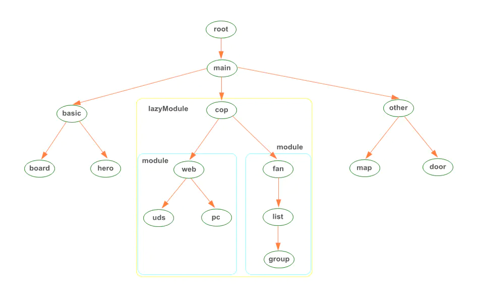
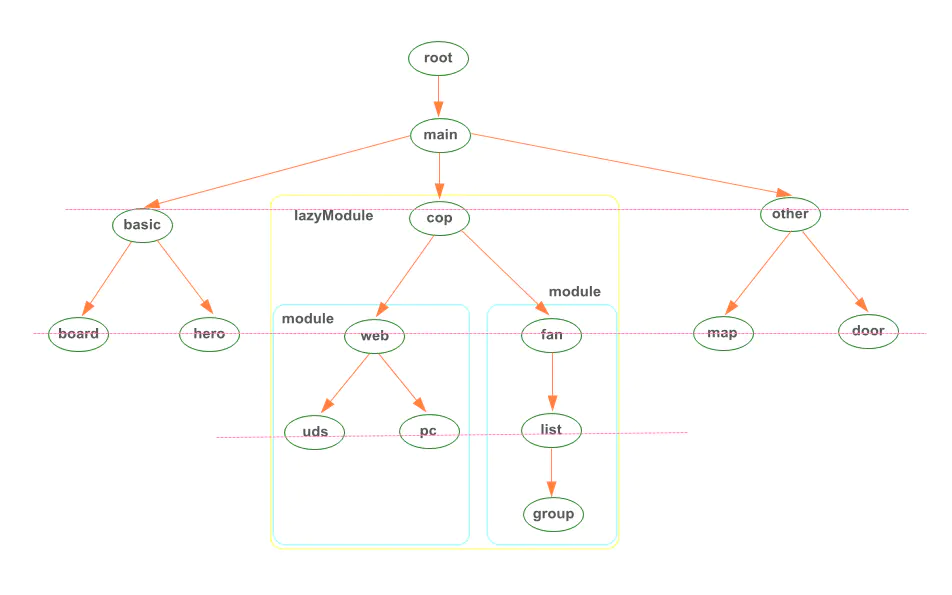

### 路由树



应用会从根开始去匹配每一级的路由节点和 routeConfig，并检测实例化路由组件，其中 routeConfig 涵盖树里的每一个节点，包括懒加载路由。

### 路由复用策略

RouteReuseStrategy 是 Angular 提供的一个路由复用策略，暴露了简单的接口。

```
abstract class RouteReuseStrategy{
  // 判断是否复用路由。进入路由触发，判断是否同一路由
  abstract  shouldReuseRoute(future:  ActivatedRouteSnapshot, curr:  ActivatedRouteSnapshot): boolean

  // 存储路由快照&组件当前实例对象
  abstract  store(route:  ActivatedRouteSnapshot, handle:  DetachedRouteHandle):  void

  // 判断是否允许还原路由对象及其子对象
  abstract  shouldAttach(route:  ActivatedRouteSnapshot): boolean

  // 获取实例对象，决定是否实例化还是使用缓存
  abstract  retrieve(route:  ActivatedRouteSnapshot):  DetachedRouteHandle  |  null

  // 判断路由是否允许复用
  abstract  shouldDetach(route:  ActivatedRouteSnapshot): boolean
}
```

> shouldReuseRoute

检测是否复用路由，该方法根据返回值来决定是否继续调用，如果返回值为 true 则表示当前节点层级路由复用，将继续下一路由节点调用，入参为的 future 和 curr 不确定，每次都交叉传入；否则，则停止调用，表示从这个节点开始将不再复用。

两个路由路径切换的时候是从“路由树”的根开始从上往下依次比较和调用，并且两边每次比较的都是同一层级的路由节点配置。root 路由节点调用一次，非 root 路由节点调用两次这个方法，第一次比较父级节点，第二次比较当前节点。



对比图示，方法的每一次调用时比较都是同一层级的路由配置节点，就是像图中被横线穿在一起的那些一样，即入参的 future 和 curr 是同级的。
shouldReuseRoute 方法的常见实现为：

```
shouldReuseRoute(future: ActivatedRouteSnapshot, curr: ActivatedRouteSnapshot): boolean {
  return  future.routeConfig  === curr.routeConfig;
}
```

当路由从"main/cop/web/pc"==>"main/cop/fan/list/group"的调用顺序：

```
root --> main  -->  web / fan (返回false)
```

即到第三层的时候 routeConfig 不一样，返回 false，调用结束，得到不复用的“分叉路由点”。

> retrieve

紧接着shouldReuseRoute方法返回false的节点调用，入参route即是当前层级路由不需要复用。以上个例子说明，此时的route是`main/cop/fan/`的路由节点。
retrieve调用根据返回结果来决定是否继续调用：如果返回的是null，当前路由对应的组件会实例化，并继续对其子级路由调用retrieve方法，直到遇到缓存路由或到末级路由。
*在本次路由还原时也会调用，用来获取缓存示例*

> shouldDetach

用来判断刚刚离开的上一个路由是否复用其调用的时机也是当前层级路由不需要复用，