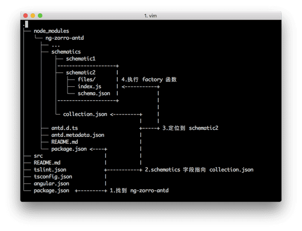

**Schematic**: 用于描述 generator，对现有文件系统没有副作用
**generator**：Angular CLI 生成器，用于执行 Schematic 生成或修改代码
**Collection**：用于定义 Schematics 列表，之后可以按 Schematic 的名称调用

### Schematics 是什么

Schematics 是现代前端开发工作流的工具；它可以将变化应用到你的项目中。比如创建一个组件、添加配置项、将框架添加到现有项目，或者更新你的代码来修复更新依赖时带来的 break change。

### 如何使用？

就和常用的`ng generate component [name]`一样，Angular6 允许三方库自定义 Schematics，现在 NG-ZORRO 对其做了支持，比如：

- `ng add ng-zorro-antd`将`ng-zorro-antd`添加到你的项目中
- `ng g ng-zorro-antd:layout-top-side --name=[name]`创建一个顶部侧边栏布局的组件

### Angular 是如何找到它的？



### 起步
```
// 安装全局依赖
npm install -g @angular-devkit/schematics-cli

// 新建一个schematics项目
schematics schematic --name my-schematics
cd my-schematics
npm install 
```

### 编译Schematics
运行下面的命令编译ts文件，并使用`npm link`将schematics链接到全局
```
npm run build
npm link
```
###使用Angular CLI 运行
新建一个Angular项目，并且将刚才的schematics`link`入进来
```
ng new schematics-test
cd schematics-test
npm link my-schematics
```
之后使用`ng generate`命令来运行schematics
```
ng generate my-schematics:my-full-schematic --name hello
```


