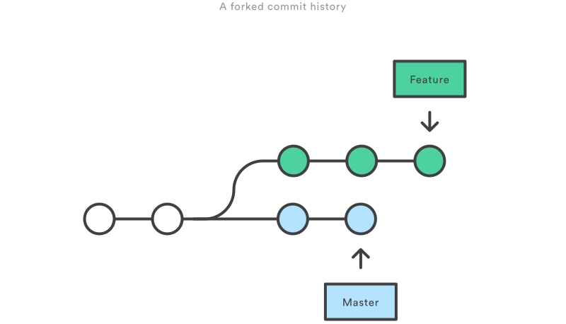

git rebase和git merge都是设计来将一个分支更改并入另一个分支，只是方式不同。

问题概述：如果你刚创建了一个专门的分支开发新功能，然后团队中的另一个成员在master分支上添加了新的提交，这就会造成提交历史被fork一份，如果在master中新的提交和你的工作是相关的，为了将新的提交并入你的分支，你将有两个选择：merge和rebase


### Merge
将master分支合并到feature分支：
```
- git checkout feature
- git merge master
或者直接：
==> git merge master feature
```
feature分支中新的合并提交（merge commit）将两个分支的历史连在一起.


Merge的好处在于它是一个安全的操作，现有的分支不会被更改，避免了rebase潜在的缺点。另一方面，这同样意味着每次合并上游更改时feature分支都会引入一个外来的合并提交。如果master非常活跃的话，这就会或多或少污染分支的历史。

### rebase
作为merge的替代选择，可以像merge一样将feature分支并入master分支：
```
git checkout feature
git rebase master
```
这会把整个feature分支移动到master分支的后面，有效地把所有master分支上新的提交并入过来，但是，rebase为原分支上每一个提交创建一个新的提交，重写了项目历史，并且不会带来合并提交。


rebase最大的好处就是项目的历史会非常整洁，首先，它不像git merge那样引入不必要的合并提交，其次，如上图所示，rebase导致最后的项目历史呈现出完美的线性——你可以从项目终点到起点浏览而不需要任何的fork，更容易使用git log、git bisect、gitk来查看项目历史。
但是，这种简单的提交历史会带来两个后果：安全性和可跟踪性。如果你违反了rebase黄金法则，重写项目历史可能会给你的协作工作带来灾难性的影响，此外，rebase不会有合并提交中附带的信息—你不会看到feature分支中并入上游的哪些更改。

> 交互式的rebase

交互式的rebase允许你更改并入新分支的提交，这比自动的rebase更加强大，因为它提供了对分支上提交历史完整的控制。一般来说，这被用于将feature分支并入master分支之前，清理混乱的历史。
把`-i`传入`git rebase`选项来开始一个交互式的rebase过程：
```
git checkout feature
git rebase -i master
```
它会打开一个文本编辑器，显示所有将被移动的提交：
```
pick 33d5b7a Message for commit #1
pick 9480b3d Message for commit #2
pick 5c67e61 Message for commit #3
```
这个列表定义了rebase将被执行后分支是什么样的，更改pick命令或者重新排序，这个分支的历史就能如你所愿了。比如说，如果第二个提交修复了第一个提交中的小问题，你可以使用fixup命令把它们合到一个提交中：
```
pick 33d5b7a Message for commit #1
fixup 9480b3d Message for commit #2
pick 5c67e61 Message for commit #3
```
保存后关闭文件，git会根据你的指令来执行rebase，项目历史看起来是这样的：


忽略不重要的提交会让分支的历史更加的清晰。这是git merge做不到的。

> Rebase的黄金法则
当你理解rebase是什么的时候，最重要的就是什么时候不能用rebase。`git rebase`的黄金法则是：绝不要在公共的分支上使用它。
如果你把master分支rebase到你的feature分支上会发生什么：


这次rebase将master分支上的所有提交都移到feature分支后面，问题是它只发生在你的代码仓库中，其他所有的开发者还在原来的master上工作。因为rebase引起了新的提交，GIt会认为你的master分支和其他人的master已经分叉了。

同步两个master分支的唯一办法是把它们merge到一起，导致一个额外的合并提交和两堆包含同样更改的提交。

> 强制推送
如果你想把rebase之后的master分支推送到远程仓库，Git会阻止，因为两个分支包含冲突，但是你可以传入`--force`标记来强行推送
```
git push --force
```
这会重写远程master分支来匹配你仓库中rebase之后的master分支，仅有的几个强制推送的场景：当你想向远程仓库推送一个私有分支之后，执行了一个本地清理（比如说为了回滚，不想推送之前那个feature分支，用现在的版本替换）。

> 本地清理
在工作流中使用rebase最好的用法之一就是清理本地正在开发的分支，隔一段时间执行一次交互式rebase，你可以保证feature分支中的每一个提交都是专注和有意义的。调用`git rebase`的时候，你又两个基（base）可以选择：上游分支（比如master）或者feature分支中早先的一个提交。

### 分支管理策略
通常，合并分支时，如果可能，Git会用`Fast forward`模式，但在这种模式下，删除分支后，会丢掉分支信息。如果强制禁用`Fast forward` 模式，Git就会在merge时生成一个新的commit，这样从分支历史上就可以看出分支信息。
- git merge --no-off -m `<`message`>`  `<`branch`>`: --no-off表示禁用`Fast forward`


