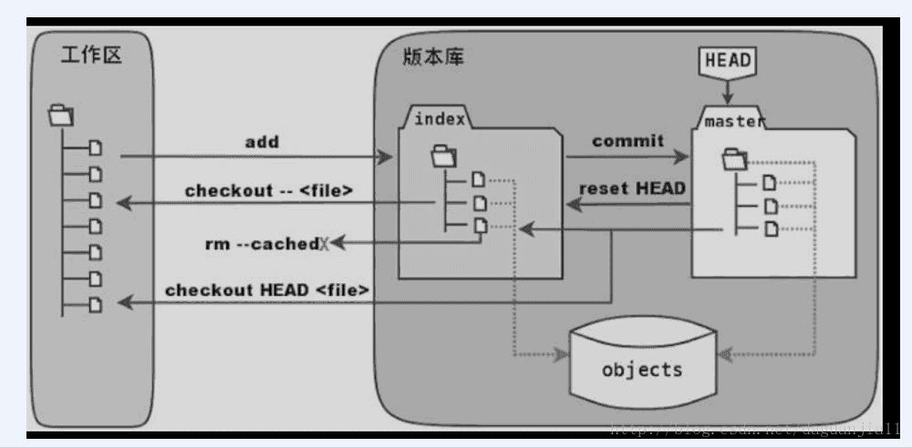
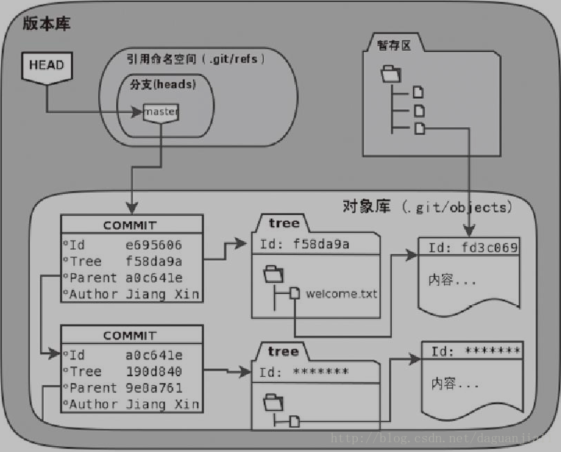

### git 暂存区



左侧是工作区，也就是本地电脑上的文件，index 就是暂存区，右侧是 HEAD（git 版本库=>工作区中隐藏的目录`.git`，Git的版本库里存了很多东西，其中最重要的就是stage（或者叫index）的暂存区，还有Git为我们自动创建的第一个分支master，以及指向master的一个指针HEAD）。HEAD 是一个头指针。git 的绝大部分操作都是在工作区、暂存区和版本库中移来移去。

> git add

把文件从工作区复制到暂存区

> git commit

把文件从暂存区复制到或提交到版本库

> git checkout --(有空格) `<`file`>`

用暂存区的某个文件来覆盖工作区，经常用于撤销一些文件内容的修改。因为会修改工作区且无法撤销。假设正在编辑 a.txt 文件需要写两段，写完第一段时，通过 git add a.txt 将 a.txt 复制到暂存区，这样的话，如果在写第二段时写错了，可以直接通过 git checkout -- a.txt 恢复到第一段完成时的样子。git checkout --（有空格）`<`file`>`是用来使工作区回到上次操作 git add 的样子。

> git checkout HEAD `<`file`>`

用版本库来同时覆盖暂存区和工作区，用来彻底撤销一个修改，会同时修改工作区和暂存区，且无法撤销。假设正在编辑 a.txt 文件需要写两段，写完第一段时，使用 git add a.txt 命令先备份到暂存区，然后接着写第二段，结果发现思路不对，就可以通过 git checkout HEAD a.txt 将工作区和暂存区中 a.txt 的修改都撤销，回到上次提交之前的样子。

> git reset HEAD `<`file`>`

git reset HEAD `<`file`>`通常用来撤销 git add 操作，并不会把文件删除，可以重新 git add。假设新增一个 c.txt 文件，并通过 git add c.txt 将此文件复制到了暂存区，但这个文件没有必要提交，可以使用 git reset HEAD c.txt 命令，它的本质是使用版本可来覆盖暂存区，由于版本库没有 c.txt，所以覆盖后，暂存区也就没有 c.txt，从而实现对 git add 命令的撤销。

> git rm -cached `<`file`>`

将一个文件从暂存区删除。假设有一个已经提交（git commit）到版本库的文件，然后发现这个文件其实不应该提交上去（例如配置文件，每个人的都不一样），但又不能直接删掉，假设这个文件的名字叫做 user.config，你可以这么操作： 1.通过 git rm --cached user.config 命令将此文件从暂存区删除 2.通过修改.gitignore 文件，把 user.config 加到文件中，使 git 忽略这个文件 3.通过 git commit -m"xxx"命令，用暂存区覆盖版本库。由于暂存区没了这个文件，覆盖后，版本库也就没了这个文件，这个文件就被这么从版本库删掉了，但是他还保留在工作区。

### git reset

应用：如果使用 git 完成 commit 之后，需要撤销，可以使用 git reset。

> HEAD

HEAD 是头指针，在链表中通过移动 HEAD 来访问其他元素。在 git 中，也是通过移动 HEAD 来访问每一次提交的。
在 git 中，HEAD 的信息保存在.git/HEAD 文件中，在我的 git 仓库中，这个文件的内容是：

```
ref: refs/heads./master
```

HEAD 是一个引用，指向`refs/heads/master`，该文件内容：

```

e55542e3fcbbae290d0a52dec376fc46bdd4e845
```

可以看出来，里面是一个哈希值 id，这个 id 其实最新的一个提交的 id。
因此，git 是如何通过 HEAD 来访问每一次提交了：HEAD 指向一个（master）分支（这里指向 master 分支），（master）分支指向一个 commit，而 commit 的 parent 又指向它的上一次提交，上一次提交的 parent 又指向上上一次提交，一直可以访问到第一次提交。每一次提交，又关联一个文件树，所以 git 通过 HEAD 还能访问到每一次提交时的所有文件的内容。


> git reset

git reset 的原理就是通过 HEAD 来操作链表，HEAD 指向 master，master 指向一个最新的提交。如果想要撤销之前的 commit，就是让 master 指向最新提交的上一次提交就可以了。

```
git reset --soft HEAD^
```

^符号代表的就是 parent，这个命令的意思就是让当前分支（这里指 master）指向 HEAD 的上一次提交。运行`git log`就会发现最新的一次提交不见了。

- git reset `[`commit] --`<`file>：commit 默认是 HEAD 所指向的提交 ID。
- git reset `[`--soft | --mixed | --hard | --merge | --keep] `[`commit]：
  - --soft 参数仅仅重置分支的引用，不会修改暂存区和工作区。用于修改注释
  - --mixed 参数是默认值，它除了会重置分支的引用外，还会重置暂存区
  - --hard 除了重置分支的引用外，还会重置暂存区和工作区

> 如何挽救一次错误的重置

通过 git reset 命令重置了分支的引用之后，通过 git log 已经无法查询出重置之前最新的提交 id 了，如果 reset 之后又后悔了，那该怎么办？
打开`.git/logs/HEAD`文件，会发现这里面记录每一次移动 HEAD 时的历史记录，

```
0000000000000000000000000000000000000000 c38c9a70c7dbddc054d65902c6f77252a6f542d3 Juphy <xxx@sina.com> 1573194860 +0800	commit (initial): 新增a.txt和b.txt文件
c38c9a70c7dbddc054d65902c6f77252a6f542d3 bfe92e63c30cdde9593cb1a9b779e371bb400a7f Juphy <xxx@sina.com> 1573197830 +0800	commit: init user.config
bfe92e63c30cdde9593cb1a9b779e371bb400a7f 699ab2ad85dcace4bdec8b05dd1b0c9e8514003f Juphy <xxx@sina.com> 1573197936 +0800	commit: XXX
```

每移动一次 HEAD 的指向就会产生一条记录，并且 HEAD 是从第一个 ID 指向了第二个 ID。首先，HEAD 从一个空指针（40 个 0）指向 c38c9a70c7dbddc054d65902c6f77252a6f542d3，然后又从 c38c9a70c7dbddc054d65902c6f77252a6f542d3 指向 bfe92e63c30cdde9593cb1a9b779e371bb400a7f。
有了这些操作记录中提交的 id，就可以继续通过 git reset `[`commit]来让 HEAD 指向你希望的那次提交了。

- git reflog：查看 HEAD 的移动历史记录，只是 git reflog 命令返回的历史记录与.git/logs/HEAD 文件中的历史记录顺序正好相反。

### git checkout
> git checkout [`<`commit>] [--] `<`file>

如果commit省略，则使用暂存区中的文件来覆盖工作区的指定文件，如果提供了commit，则使用版本库中的某次提交的文件来覆盖暂存区和工作区的指定文件。
- git checkout -- a.txt 使用暂存区中的a.txt覆盖工作区中的a.txt，用于丢弃git add命令以后的修改
- git checkout HEAD -- a.txt 使用HEAD指向的最新提交来覆盖暂存区和工作区中的a.txt文件。

> git checkout `[`branch]

用来切换分支

> git checkout -b `<`new_branch> `<`start_commit>

用来创建分支，`-b`参数是必须的。 new_branch是新分支的名字，start_commit参数用来指定在哪次提交的基础上来创建新的分支，默认为HEAD指向的最新提交。
- git checkout -b dev：在最新提交上创建一个dev分支
- git checkout -b dev HEAD^ 在HEAD的上一次提交上创建一个dev分支

> git checkout `<`commit>

是HEAD直接指向一个提交，并且用该提交的文件树来覆盖暂存区和工作区，然后进入头指针分离状态(detached HEAD)。如果你想回到以前的某个提交来查看当时的所有文件，就可以使用这个命令。


### git stash

应用场景：正在 dev 分支开发新的功能，做到一半的时候有 BUG 需要解决，但是新功能不想提交，这时可以使用 git stash 先把当前进度保存起来，然后切到另一个分支去修改 bug，修改完提交后，再切回 dev 分支，使用 git stash pop 来的恢复之前的进度继续开发新功能。

> git stash

保存当前工作进度，会把暂存区和工作区的改动保存起来，执行完这个命令后，再运行 git status，会发现当前是一个干净的工作区，没有任何的改动，使用 git stash save "message" 可以添加一些注释。

> git stash list

显示保存进度的列表。也意味着，git stash 命令可以多次执行。

> git stash pop `[`--index`]` `[`stash_id`]`

git stash pop 恢复最新的进度到工作区，git 会默认把工作区和暂存区的改动都恢复到工作区
git stash pop --index 恢复最新的进度到工作区和暂存区。（尝试将原来暂存区的改动恢复暂存区）
git stash pop stash@{1} 恢复指定的进度到工作区。stash_id 是通过 git stash list 命令得到的通过 git stash pop 命令恢复进度后，会删除当前进度。

> git stash apply `[`--index] `[`stash_id]

除了不删除恢复的进度之外，其余和 git stash pop 命令一样。

> git stash drop `[`stash_id]

删除一个存储的进度。如果不指定 stash_id，则默认删除最新的存储进度。

> git stash clear

删除所有存储的进度

> 如果在同一分支下进行 git stash，在进行 bug 修复时，如果修复的 bug 部分与保存的暂存文件的内容冲突时，这样使用 git stash pop 进行恢复暂存时会出现冲突。

```
> 初始化一个版本仓库，新建一个文件test并且提交，作为master分支上的根commit
git init
touch test
git add test
git commit -m "init test"
git log

> 切换另一个分支，新建文件并提交
git checkout -b anothertest
touch anothertest
git add anothertest
git commit -m "init anothertest"
git log

> 在another分支上修改test和anothertest文件的内容，使用`git stash`进行暂存，代表工作的一半的成果，无法作为一个完整的commit进行提交
vim test
vim anothertest
git stash
git stash list

> 回到master分支，修改test文件并提交commit，模拟master分支出现了another分支需要使用的代码，这个时候分支树出现了分叉，master分支和another分支各自进行一个commit
git checkout master
vim test
git add test
git commit -m "changes on branch master"
git log

> 再回到another分支，使用`git rebase`进行变基，模拟another分支取得master分支上的最新代码，这时分支树又变成一条直线
git checkout another
git rebase master
git log

> 特性分支成功取得了主分支上需要用到的代码，但是执行`git stash pop`想取出之前工作一半的成果后，却出现了冲突
git stash pop
git status
// git status 查看状态的时候，可以看到Git是有标出冲突，这个时候按照解决普通的pull  conflict的方式修改文件即可，然后执行`git add`，如果完全接受主分支的修改，那么再次查看`git status`的时候这个文件就不出现在状态里了。
vim test
git add test
git status

> 如果不想把某些文件中的某一个作为下个commit的内容提交到远程，再次执行`git reset HEAD`，就恢复`git stash pop`后该有的状态了，只是conflict已经解决
git reset HEAD 
git status 
// 冲突解决后，Git并不会删除之前的stash记录，可以使用`git stash drop`将没用的记录删除掉
git stash list
git stash drop stash@{0}
git stash list
```