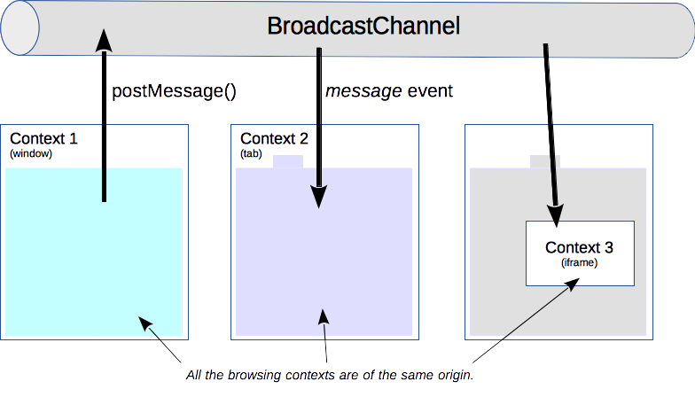

### Broadcast Channel
同源页面间通信，可以使用`localStorage`和`storag`。
Broadcast Channel API可以实现同源下浏览器不同窗口、tab或者iframe下的浏览器上下文之间的简单通讯。通过创建一个监听某个频道下的`BroadcastChannel`对象，可以接收发送给该频道的所有信息。



```
// 创建一个用于广播的通信通道
const channel = new BroadcastChannel('my_bus');

// 在my_bus上发送信息
channel.postMessage('hello world!');

// 监听my_bus通道上的信息
channel.onmessage = function(e){
    console.log('已收到的信息', e.data);
}

// 关闭通道
channel.close();
```
Broadcast Channel API除了支持发送字符串之外，还可以发送其他对象，比如Blob、File、ArrayBuffer、Array等对象。
在IE 11及以下的版本，是不支持Broadcast Channel API，可以使用现成的broadcast-channel-polyfill或者`localStorage`和`storage`事件来实现。

### Broadcast Channel API应用场景
- 实现同源页面间数据不同
- 在其他tab页面中监测用户操作
- 指导worker执行一个后台任务
- 知道用户何时登录另一个window/tab中的账户

> 实现同源页面间数据同步

```html
    <h3 id="title">hello, </h3>
    <input id="userName" placeholder="请输入你的用户名">
```
```js
    const bc = new BroadcastChannel('my_channel');

    (() => {
        const title = document.querySelector('#title'),
            userName = document.querySelector('#userName');

        const setTitle = (userName) => {
            title.innerHTML = "你好，" + userName;
        }

        bc.onmessage = (messageEvent) => {
            if (messageEvent.data === "update_title") {
                setTitle(localStorage.getItem('title'));
            }
        }

        if (localStorage.getItem(title)) {
            setTitle(localStorage.getItem(title));
        } else {
            setTitle("请填写你的名字")
        }

        userName.addEventListener('input', function (e) {
            const inputValue = e.target.value;
            localStorage.setItem("title", inputValue);
            setTitle(inputValue);
            bc.postMessage("update_title");
        })
    })()
```
当任何一个已打开的页面中，输入框的数据发生变化时，页面中的`h3#title`元素的内容将会自动实现同步更新。

> 在其它Tab页面中监测用户操作

利用Broadcast Channel API，除了可以实现同源页面间的数据同步之外，还可以利用它来实现在其它Tab页面中监测用户操作的功能。比如，当用户在任何一个Tab中执行退出操作后，其它已打开的tab页面也能够自动实现退出，从而保证系统的安全性。
```html
<h3 id="status">当前状态：已登录</h3>
<button onclick="logout()">退出</button>
```

```JavaScript
const status = document.querySelector("#status");
const logoutChannel = new BroadcastChannel("logout_channel");

logoutChannel.onmessage = function (e) {
  if (e.data.cmd === "logout") {
    doLogout();
  }
};

function logout() {
  doLogout();
  logoutChannel.postMessage({ cmd: "logout", user: "阿宝哥" });
}

function doLogout() {
  status.innerText = "当前状态：已退出";
}
```
当用户点击退出按钮后，当前页面会执行退出操作，同时会通过`logoutChannel`通知其它已打开的页面执行退出操作。

### Broadcast Channel API和postMessage API
与postMessage()不同的是，Broadcast Channel不再需要维护对iframe或worker的引用才能与其进行通信：
```
const popup = window.open("https://xxxx");
popup.postMessage('Sup popup!', "https://xxxx")
```
Broadcast Channel API只能用于实现同源下浏览器不同窗口、Tab页或者iframe下的浏览器上下文之间的简单通讯。而postmessage API却可用于实现不同源之间信息通信，由于保证消息来自于同一源，因此无需像以前那样使用以下方法来验证消息：
```JavaScript
const iframe = document.querySelector('iframe');
iframe.contentWindow.onmessage = function(e){
    if(e.origin!=="http://expected-origin.com"){
        return;
    }
    e.source.postMessage("Ack!", e.origin);
}
```
