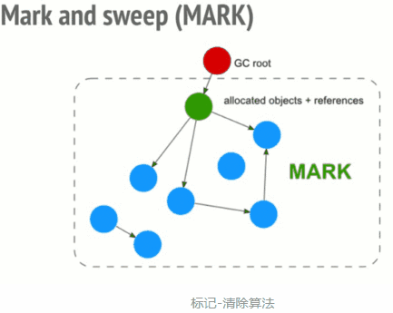
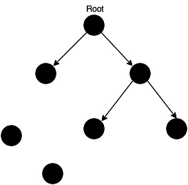

## JavaScript中的垃圾回收和内存泄漏
程序的运行需要内存。只要程序提出要求，操作系统或者运行时就必须供给内存。所谓的内存泄漏简单来说是不再用到的内存，没有及时释放。
在C与C++等语言中，开发人员可以直接控制内存的申请和回收。但是在Java、C#、JavaScript语言中，变量的内存空间的申请和释放都由程序自己处理，开发人员不需要关心。也就是说Javascript具有自动垃圾回收机制(Garbage Collecation)。

回收规则：
1.全局变量不会被回收。
2.局部变量会被回收，也就是函数一旦运行完以后，函数内部的东西都会被销毁
3.只要被另外一个作用域所引用就不会被回收（闭包中引用的变量不会被回收）


### 垃圾回收的必要性
由于字符串、对象和数组没有固定大小，所有当他们的大小已知时，才能对他们进行动态的存储分配。JavaScript程序每次创建字符串、数组或对象时，解释器都必须分配内存来存储那个实体。只要像这样动态地分配了内存，最终都要释放这些内存以便他们能够被再用，否则，JavaScript的解释器将会消耗完系统中所有可用的内存，造成系统崩溃。

这个句话解释了为什么系统需要垃圾回收，JavaScript不想C/C++，它有自己的一套垃圾回收机制。

JavaScript垃圾回收的机制很简单：找出不再使用的变量，然后释放掉其占用的内存，但是这个过程不是时时的，因为其开销比较大，所以垃圾回收器会按照固定的时间间隔周期性的执行。
```
var a = 'a';
var b = "b";
a = b; // 重写a， 那么字符串'a'，就会被释放。
```
字符串'a'失去了引用，系统检测到这个事实之后，就会释放该字符串的存储空间以便这些空间可以被再利用。

### 垃圾回收机制
垃圾回收有两种方法：`标记清除`、`引用计数`。引用计数不太常用，标记清除较为常用。

#### 标记清除
这是JavaScript最常用的垃圾回收方式。当变量进入执行环境时，就标记这个变量为"进入环境"。从逻辑上讲，永远不能释放进入环境的变量所占用的内存，因为只要执行流进入相应的环境，就可能会用到他们。当变量离开环境时，则将其标记为“离开环境”。
垃圾回收机制在运行的时候会给存储在内存中的所有变量都加上标记。然后，它会去掉环境中的变量以及被环境中的变量引用的变量标记。而在此之后剩下的带有标记的变量被视为准备删除的变量，原因是环境中的变量已经无法访问到这些变量了。最后垃圾回收机制到下一个周期运行时，将释放这些变量的内存，回收它们所占用的空间。
到目前为止，IE、Firefox、Opera、Chrome、Safari的js实现使用的都是标记清除的垃圾回收策略或类似的策略，只不过垃圾收集的时间间隔互不相同。




```
var m = 0,n = 19 // 把 m,n,add() 标记为进入环境。
add(m, n) // 把 a, b, c标记为进入环境。
console.log(n) // a,b,c标记为离开环境，等待垃圾回收。
function add(a, b) {
  a++
  var c = a + b
  return c
}
```

#### 引用计数
所谓"引用计数"是指语言引擎有一张"引用表"，保存了内存里面所有的资源（通常是各种值）的引用次数。如果一个值的引用次数是0，就表示这个值不在被用到，因此可以将这块内存释放。

上图中，左下角的两个值，没有任何引用，所以可以释放。

如果一个值不在需要了，引用数却不为0，垃圾回收机制无法释放这块内存，从而导致内存泄漏。
```
var arr = [1, 2, 3, 4]; 数组[1, 2, 3, 4]是一个值，会占用内存。变量arr是仅用的对这个值的引用，因此引用次数为1。
arr = [2, 4, 5]; 数组[1, 2, 3, 4]引用的变量arr又取得另外一个值，则数组[1, 2, 3, 4]
```