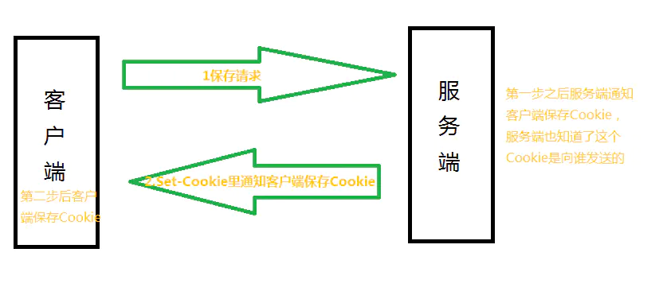
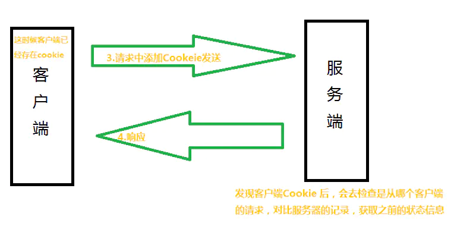

### HTTP
超文本传输协议是一种用于分布式、协作式和超媒体信息系统的应用层协议。HTTP是万维网的数据通信的基础，设计HTTP最初的目的是为了提供一种发布和接收HTML页面的方法。通过HTTP或者HTTPS协议请求的资源由统一资源标识符（Uniform Resource Identifiers，URI）来标识。

HTTP是无状态协议，说明它不能以状态来区分和管理请求和响应，也就是说，服务器单从网络连接上无从知道客户身份。`这就需要给客户端们颁发一个通行证吗，每人一个，无论谁访问都必须携带自己通行证，这样服务器就能从通行证上确认客户身份了。`这就是Cookie的工作原理。

### Cookie
Cookie是客户端保存用户信息的一种机制，用来记录用户的一些信息，实际上Cookie是服务器保存在浏览器的一小段文本信息，每个 Cookie 的大小一般不能超过4KB，并随着每次请求发送到服务器。

`Cookie技术通过请求和响应报文中写入Cookie信息来控制客户端的状态。`

Cookie会根据响应报文里的一个Set-Cookie的首部字段信息，通知客户端保存Cookie。当下客户端再向服务端发起请求时，客户端会自动在请求报文中加入Cookie值之后发送出去。

之后服务端发现客户端发送过来的Cookie之后，会检查是那个客户端发送过来的请求，然后对服务器上的记录，最后得到了之前的状态信息。


客户端保存了Cookie之后发起请求：


> 工作原理
1.创建cookie

当用户第一次浏览某个使用cookie的网站时，该网站的服务器就进行如下的工作：
- 该用户生成唯一的识别码（Cookie ID），创建一个Cookie对象。
- 默认情况下它是一个会话级别的cookie，存储在浏览器的内存中，用户退出浏览器之后被删除，如果网站希望浏览器将该Cookie存储在磁盘上，则需要设置最大时效（maxAge）,并给出一个以秒为单位的时间（将最大时效设为0则是命令浏览器删除该cookie）
- 将cookie放入到HTTP请求报头，将Cookie插入到一个Set-Cookie HTTP响应报头中
- 发送该HTTP响应报文

2.设置存储Cookie

浏览器收到该响应报文之后，根据报文头里的Set-Cookie特殊的指示，生成相应的Cookie，保存在客户端。

3.发送Cookie

当用户再次访问该网站时，浏览器首先检查所有存储的Cookies，如果某个存在该网站的Cookie（即该Cookie所声明的作用范围大于等于将要请求的资源），则把该Cookie附在请求资源的HTTP请求头上发送给服务器。

4.读取Cookie

服务器接收到用户的HTTP请求报文后，从报文头获取到该用户的Cookie，从里面找到所需要的东西。

> Set-Cookie
```
Set-Cookie: logcookie=3qjj; expires=Wed, 13-Mar-2019 12:08:53 GMT; Max-Age=31536000; path=/;
 domain=fafa.com;secure; HttpOnly;
```
1.`logcookie=3qjj`赋予Cookie的名称和值，logcookie是名字，3qjj是值。Cookie可以包含多个字段，使用`;`分隔。`Set-Cookie: name=value;name2=value2;name3=value3`
2.`expires`是设置cookie有效期的UTC格式，可以使用Date.prototype.toUTCString()进行日期格式转换。当省略expires属性时或者设置为null，Cookie只在当前会话（session）有效，浏览器窗口一旦关闭，当前Session结束，该Cookie就会被删除。删除一个现存 Cookie 的唯一方法，是设置它的expires属性为一个过去的日期。
3.`Max-Age`属性指定从现在开始Cookie存在的秒数。如果同时指定了`Expires`和`Max-Age`，那么`Max-Age`的值将优先生效。如果Set-Cookie字段没有指定Expires或Max-Age属性，那么这个 Cookie 就是 Session Cookie，即它只在本次对话存在，一旦用户关闭浏览器，浏览器就不会再保留这个 Cookie。
4.`path`是限制指定Cookie的发送范围的文件目录。`/`表示这个Cookie对该域名的根路径和它的所有子路径都有效，如果路径为`/formus`，那么这个Cookie只有在访问`www.fafa.com/formus`及其子路径时才有效。`path`必须是绝对路径，默认为当前路径。
5.`domain`通过domain属性指定的域名可以做到与结尾匹配一致。比如，指定domain是fafa.com，除了fafa.com，www.fafa.com等都可以发送Cookie。
6.`secure`设置web页面只有在HTTPS安全连接时，才可以发送Cookie。HHTP则不可以进行回收。
7.`HttpOnly`使JavaScript脚本无法获得Cookie，主要是`Document.cookie`属性、XMLHttpRequest对象和RequestAPI都得不到该属性。只有浏览器发出 HTTP 请求时，才会带上该 Cookie。

> document.cookie

`document.cookie`属性用于读写当前网页的所有Cookie，前提是该Cookie不能有`HTTPOnly`属性。`document.cookie`属性是可写的，可以通过它为当前网站添加Cookie。写入的时候，Cookie的值必须写成`key=value`的形式。注意，等号两边不能有空格，另外，写入Cookie，必须对分号、逗号和空格进行转义（它们都不允许作为Cookie的值），这可以用`encodeURIComponent`方法做到。

`document.cookie`读写行为的差异（一次可以读出全部Cookie，但是只能写入一个Cookie），与HTTP协议的Cookie通信格式有关。浏览器向服务器发送Cookie的时候，`Cookie`字段是使用一行将所有Cookie全部发送；服务器向浏览器设置Cookie的时候，`Set-Cookie`字段是一行设置一个Cookie。

写入Cookie的时候，可以一起写入Cookie的属性。
```
document.cookie = "foo=bar; expires=Fri, 31 Dec 2020 23:59:59 GMT";

document.cookie = 'fontSize=14; '
  + 'expires=' + someDate.toGMTString() + '; '
  + 'path=/subdirectory; '
  + 'domain=*.example.com';
```
写入Cookie的时候，同时设置了`expires`属性。属性值的等号两边，也是不能有空格的。

浏览器可以设置不接受Cookie，也可以设置不想服务器发送Cookie。
`window.navigator.cookieEnabled`属性返回一个布尔值，表示浏览器是否打开Cookie功能。
`document.cookie`属性返回当前网页的Cookie。

不同浏览器器对Cookie数量和大小的限制，是不一样的。一般来说，单个域名设置的Cookie不应超过30个，每个Cookie的大小不能超过4KB。超过限制以后，Cookie将被忽略，不会被设置。浏览器的同源政策规定，两个网址只要域名相同和端口相同，就可以共享Cookie。不要求协议相同，`http://example.com`设置的Cookie，可以被`https://example.com`读取。

> 作用

1.对话管理：记住密码，保存登录、购物车等需要记录的信息
2.个性化：保存用户的偏好，比如网页的字体大小、背景色等
3.追踪：记录和分析用户行为，记录用户浏览数据，进行商品推荐

> 缺陷

1.Cookie会被附加在每个HTTP请求中，所以无形中增加了流量
2.由于在HTTP请求中的Cookie是明文传递的，所以安全性有问题（除非用HTTPS）
3.Cookie的大小限制在4KB左右，对于复杂的存储需求来说是不够用的


### Session
Session代表服务器与浏览器的一次会话过程，这个过程是连续的，也可以时断时续。Session是一种服务端机制，Session对象用来存储特定用户会话所需的信息。

Session有服务端生成，保存在服务器的内存、缓存、硬盘或数据中。

> 创建Session

当用户访问一个服务器，如果服务器启用Session，服务器就要为该用户创建一个SESSION，在创建这个SESSION的时候，服务器首先检查这个用户发送来的请求里是否包含了一个SESSION ID，如果包含了一个SESSION ID则说明之前该用户已经登陆过并为此用户创建过SESSION，那服务器就按照这个SESSION ID把这个SESSION在服务器的内存中查找出来（如果找不到，就有可能为他新创建一个），如果客户端请求里面不包含SESSION ID，则为该客户端创建一个SESSION并生成一个与此SESSION相关的SESSION ID。这个`SESSION ID是唯一的、不重复的、不容易找到规律的字符串`

`URL重写`：把Session id直接附加在URL路径的后面作为URL路径的附加信息，表现形式为：http://…./xxx;jSession=ByOK3vjFD75aPnrF7C2HmdnV6QZcEbzWoWiBYEnLerjQ99zWpBng!-145788764
`作为查询字符串附加在URL后面`：http://…../xxx?jSession=ByOK3vjFD75aPnrF7C2HmdnV6QZcEbzWoWiBYEnLerjQ99zWpBng!-145788764
`表单隐藏字段`，服务器会自动修改表单，添加一个隐藏字段，以便在表单提交时能够把Session id传递回服务器。

> 作用：Session的根本作用是在服务端存储用户和服务器会话的一些信息

1.判断用户是否登录
2.购物车功能

### Cookie和Session的区别
1.存放位置：Cookie保存在客户端，Session保存在服务端
2.存取方式不同：Cookie只能保存ASCII字符串，假如需求存取Unicode字符或者二进制数据，需要先进行编码。而Session中能够存取任何类型的数据，包括而不限于String、Integer、list、Map等。
3.安全性：Cookie存储在浏览器中，对客户端是可见的，客户端的一些程序可能会复制或者修改Cookie中的内容。而Session存储在服务器上，对客户端是透明的，不存在敏感信息泄露的风险。
4.有效期：Cookie的有效期依赖于过期时间属性，Session依赖于名为JSESSIONID的cookie，而Cookie JSESSIONID的过期时间默许为-1，只需要关闭浏览器（一次会话结束），该Session就会失效。
5.对服务器造成的压力不同：Session是存储在服务器端的，每个用户都会产生一个Session，假如并发访问的用户非常多，会产生非常多的Session，耗费大量的内存，而Cookie存储在客户端，不占用服务器资源。
6.跨域支持上的不同：Cookie支持跨域名访问，例如将domain属性设置为'baidu.com'，则以"baidu.com"为后缀的一切域名均能够访问该Cookie。跨域名Cookie如今被普遍用于网络中，而Session则不会支持跨域名访问。Session仅在它所在的域名内有效。