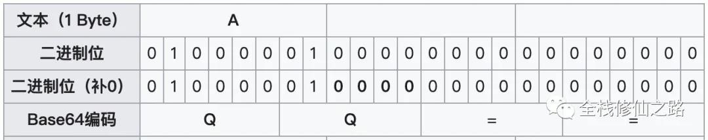
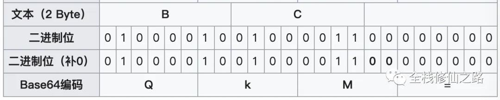
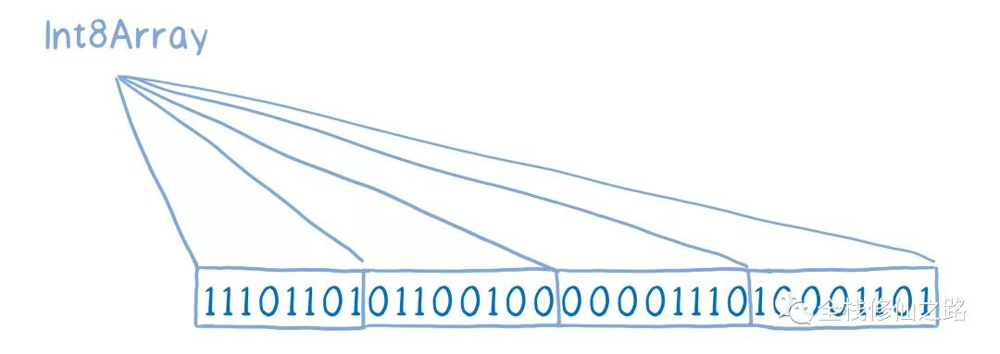
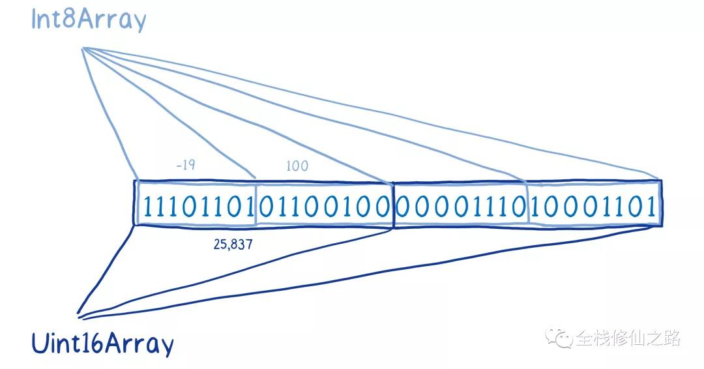

> 前端处理图片流程


> 图片相关数据转换


### 本地图片预览
> FileReader API

在支持FileReader API的浏览器中，可以利用该API方便地实现图片本地预览。
```html
<!DOCTYPE html>
<html>
  <head>
    <meta charset="UTF-8" />
    <meta name="viewport" content="width=device-width, initial-scale=1.0" />
    <title>图片本地预览示例</title>
  </head>
  <body>
    <h3>图片本地预览示例</h3>
    <input type="file" accept="image/*" onchange="loadFile(event)" />
    

    <script>
      const loadFile = function (event) {
        const reader = new FileReader();
        reader.onload = function () {
          const output = document.querySelector("#previewContainer");
          output.src = reader.result;
        };
        reader.readAsDataURL(event.target.files[0]);
      };
    </script>
  </body>
</html>
```
为`file`类型的输入框绑定`onchange`事件处理函数`loadFile`，在该函数中，创建一个FileReader对象并为该对象绑定`onload`相应的事件处理函数，然后调用FileReader对象的readAsDataURL()方法，把本地图片对应的File对象转换为Data URL。
`对于 FileReader 对象来说，除了支持把 File/Blob 对象转换为Data URL之外，它还提供了readAsArrayBuffer() 和 readAsText() 方法，用于把 File/Blob 对象转换为其他的数据格式。`

当文件读取完成后，会触发绑定的`onload`事件处理函数，在该处理函数内部会把获取Data URL数据赋给`img`元素的`src`属性，从而实现图片本地预览。

此时img元素的src属性是一串非常奇怪的字符串：
```
data:image/png;base64,iVBORw0KGgoAAAANSUhEUgAAAhAAAAIwCAYAAADXrFK
```
这串奇怪的字符串被称为Data URL，它由四个部分组成：前缀(data:)、指示数据类型的MIME类型、如果非文本则可选的`base64`标记、数据本身：
```
data:[<mediatype>][;base64],<data>
```
`mediatype`是个MIME类型的字符串，比如"image/png"表示PNG图像文件，如果被省略，则默认值为`text/plain;charset=US-ASCII`。如果数据是文本类型，可以直接将文本嵌入（根据文档类型，使用合适的实体字符或转义字符）。
如果是二进制数据，可以将数据进行base64编码之后再进行嵌入。
```
MIME(Multipurpose Internet Mail Extensions)多用途互联网邮件扩展类型，
是设定某种 扩展名的文件用一种应用程序来打开的方式类型，当该扩展名文件
被访问的时候，浏览器会自动使用应用程序来打开。多用于指定一些客户端自
定义的文件名，以及一些媒体文件打开方式。

常见的MIME类型有：超文本标记语言文本 .html text/html、PNG图像 
.png image/png、普通文本 .txt text/plain等。
```
在Web项目开发过程中，为了减少HTTP请求的数量，对应一些较小的图标，通常会使用Data URL的形式内嵌到HTML
或CSS文件中。`但需要注意的是：如果图片较大，图片的色彩层次比较丰富，则不适合使用这种方式，因为该图片经过
base64编码后的字符串非常大，会明显增大HTML页面的大小，从而影响加载速度。`

在Data URL中，数据是很重要的一部分，它使用base64编码的字符串来表示，因此要掌握Data URL，还需要了解Base64。

> Base64

`Base64`是一种基于64个可打印字符来表示二进制数据的表示方法，由于 2^6 = 64，所以每6个比特为一个单元，对应某
个可打印字符。3个字节有24个比特，对应于4个base64单元，即3个字节可由4个可打印字符来表示。相应的转换过程如下：


`Base64常用于在处理文本数据的场合，表示、传输、存储一些二进制数据，包括MIME的电子邮件及XML的一些复杂数据。`
在MIME格式的电子邮件中，base64可以用来将二进制的字节序列编码成ASCII字符序列构成的文本。使用时，在传输编码方
式中指定 base64。使用的字符包括大小写拉丁字母各 26 个、数字 10 个、加号 + 和斜杠 /，共 64 个字符，等号 = 用来作为后缀用途。

base64 相应的索引表如下：


以编码`Man`为例，`Man`由M、a和n这三个字符组成，它们对应的ASCII码为77，97和110。


然后再以每6个比特为一个单元，进行base64编码操作


由图可知，`Man`(3个字节)编码的结果为`TWFu`(4个字节)，很明显经过base64编码后体积增加1/3。`Man`这个字符串的长度
刚好是3，我们可以用4个base64单元来表示。但如果待编码的字符串长度不是3的整数倍时，应该如何处理？
`
如果要编码的字节数不能被 3 整除，最后会多出 1 个或 2 个字节，那么可以使用下面的方法进行处理：先使用 0 字节值在末
尾补足，使其能够被 3 整除，然后再进行 base64 的编码。
`
以编码字符A为例，其所占的字节数为1，不能被3整除，需要补2个字节：


字符`A`经过base64编码后的结果是`QQ==`，该结果后面的两个`==`代表补足的字节数。而最后1个base64字节块有4位是0值。

假设需要编码的字符串`BC`，其所占字节数为2，不能被3整除，需要补1个字节：


字符串`BC`经过base64编码后的结果是`QkM=`，该结果后面的1个`=`代表补足的字节数。而最后1个base64字节块有2位是0值。

在JavaScript中，有两个函数被分别用来处理解码和编码base64字符串：
- btoa(): 该函数能够基于二进制数据“字符串”创建一个base64编码的ASCII字符串
- atob(): 该函数能够解码通过base64编码的字符串数据

> btoa

```
const name = "Semlinker";
const encodeName = btoa(name);
console.log(encodeName); // U2VtbGlua2Vy
```

> atob

```
const encodeName = "U2VtbGlua2Vy";
const name = atob(encodeName);
console.log(name); // Semlinker
```
对于atob和btoa这两个方法来说，其中的a代表ASCII，而b代表Blob，即二进制。因此atob表示的是ASCII到二进制，对应的是解码操作。而btoa表示二进制到ASCII，对应的是编码操作。
**base64只是一种数据编码方式，目的是为了保障数据的安全传输。但标准的base64编码无需额外的信息，即可以进行解码，是完全可逆的，因此在涉及传输私密数据时，并不能直接使用base64编码，而是要使用专门的对称或非对称加密算法。**


### 网络图片预览
对于网络上可正常访问的图片地址，直接把地址赋给`img`元素，并不需要通过`fetch API`，如果需要在显示图片时，需要对图片进行特殊处理，就需要`fetch API`从网络上获取图片数据并进行解密操作。
```html
<!DOCTYPE html>
<html>
  <head>
    <meta charset="UTF-8" />
    <meta name="viewport" content="width=device-width, initial-scale=1.0" />
    <title>获取远程图片预览示例</title>
  </head>
  <body>
    <h3>获取远程图片预览示例</h3>
    

    <script>
      const image = document.querySelector("#previewContainer");
      fetch("https://avatars3.githubusercontent.com/u/4220799")
        .then((response) => response.blob())                                                                                           
        .then((blob) => {
          const objectURL = URL.createObjectURL(blob);
          image.src = objectURL;
        });
    </script>
  </body>
</html>
```
使用`fetch API`下载图像，当请求成功后，把响应对象（Response）转换为Blob对象，然后使用`URL.createObjectURL`方法，创建Object URL并把它赋给`img`元素的`src`属性，从而实现图片的显示。

此时`img`元素的`src`属性值是一串非常特殊的字符串：
```
blob:null/ab24c171-1c5f-4de1-a44e-568bc1f77d7b
```
这个特殊的字符串，我们称之为`Object URL`，相比前面的Data URL，更加简洁。

> Object URL

Object URL是一种伪协议，也称为Blob URL。它允许Blob或File对象用作图像，下载二进制数据链接等的URL源。在浏览器中，使用`URL.createObjectURL`方法来创建Blob URL，该方法接收一个`Blob`对象，并为其创建一个唯一的URL，其形式为`blob:<origin>/<uuid>`：
```
blob:https://example.org/40a5fb5a-d56d-4a33-b4e2-0acf6a8e5f641
```
浏览器内部每个通过`URl.createObjectURL`生成的URL存储了一个`URL -> Blob`的映射，因此，此类URL较短，但可以访问`Blob`。生成的URL仅在当前文档打开状态下才有效。但如果你访问的Blob URL不在存在，则会从浏览器收到404错误。
虽然存储了`URL -> Blob`的映射，但Blob本身仍驻留在内存中，浏览器无法释放它，映射在文档卸载时自动清除，因此Blob对象随后释放，但是如果应用程序寿命很长，那就不会很快发生。因此，如果我们创建一个Blob URL，即使不在需要改Blob，它也会存在内存中。

针对这样的问题，可以调用`URl.revokeObjectURL(url)`方法，从内部映射中删除引用，从而允许删除Blob（如果没有其他引用），并释放内存。

> ArrayBuffer与TypedArray（具体查看ES2015）

ArrayBuffer 对象用来表示`通用的、固定长度的`原始二进制数据缓冲区。`ArrayBuffer不能直接操作，而是通过类型数组对象或DataView对象来操作`，它们会将缓冲区中的数据表示为特定的格式，并通过这些格式来读写缓冲区的内容。

```
ArrayBuffer 简单说是一片内存，但是你不能直接用它。这就好比你在 C 里面，malloc 一片内存出来，你也会把它转换成 unsigned_int32 或者 int16 这些你需要的实际类型的数组/指针来用。

这就是 JS 里的 TypedArray 的作用，那些 Uint32Array 也好，Int16Array 也好，都是给 ArrayBuffer 提供了一个 “View”，MDN 上的原话叫做 “Multiple views on the same data”，对它们进行下标读写，最终都会反应到它所建立在的 ArrayBuffer 之上。
```
- new ArrayBuffer(length)
  - 参数：length表示要创建的ArrayBuffer的大小，单位为字节
  - 返回值：一个指定大小的ArrayBuffer对象，其内容被初始化为0
  - 异常：如果length大于`Number.MAX_SAFE_INTERGE`(>= 2 ** 53)或为负数，则抛出一个`RangError`异常。

创建一个8字节的缓冲区，并使用一个`Int32Array`来引用它：
```
let buffer = new ArrayBuffer(8);
let view = new Int32Array(buffer);
```
从ECMAScript2015 开始，`ArrayBuffer`对象需要用`new`运算符创建。如果调用构造函数时没有使用`new`，将会抛出`TypeError`异常。
对于一些常用的Web API，例如FileReader API和Fetch API底层也是支持ArrayBuffer
```
const reader = new FileReader();

reader.onload = function(e) {
  let arrayBuffer = reader.result;
}

reader.readAsArrayBuffer(file);
```
> Uint8Array

Uint8Array数组类型表示一个8位无符号整型数组，创建时内容被初始化为0。创建完后，可以以`对象的方式或使用数组下标索引的方式`引用数组中的元素。
```语法
new Uint8Array(); // ES2017
new Uint8Array(length); // 创建初始化为0的，包含length个元素的无符号整型数组
new Uint8Array(typedArray);
new Uint8Array(object);
new Uint8Array(buffer [, byteOffset [, length]]);
```

```示例
// new Uint8Array(length); 
var uint8 = new Uint8Array(2);
uint8[0] = 42;
console.log(uint8[0]); // 42
console.log(uint8.length); // 2
console.log(uint8.BYTES_PER_ELEMENT); // 1

// new TypedArray(object); 
var arr = new Uint8Array([21,31]);
console.log(arr[1]); // 31

// new Uint8Array(typedArray);
var x = new Uint8Array([21, 31]);
var y = new Uint8Array(x);
console.log(y[0]); // 21

// new Uint8Array(buffer [, byteOffset [, length]]);
var buffer = new ArrayBuffer(8);
var z = new Uint8Array(buffer, 1, 4);
```
> ArrayBuffer与TypedArray之间的关系

ArrayBuffer本身只是一行0和1的串，ArrayBuffer不知道该数组第一个元素和第二个元素之间的分隔位置。


为了提供上下文，实际上要将其分解为多个盒子，需要将其包装在所谓的视图中，可以使用类型数组添加这些数据视图，并且可以使用许多不同类型的类型数组。
例如，一个Int8类型的数组，它将把这个数组分成8-bit的字节数组


或者一个无符号Int16数组，它会把数组分成16-bit的字节数组，并且把它当作无符号整数来处理。


在同一基本缓冲区上拥有多个视图，对于相同的操作，不同的视图会给出不同的结果。例如，如果从这个ArrayBuffer的Int8视图中获取0 & 1元素的值（-19 & 100），它将给我们与Uint16视图中元素0（25837）不同的值，即使它们包含完全相同的位。

这样ArrayBuffer基本上就像原始内存一样，它模拟使用C之类语言进行的直接内存访问。`为什么我们不让程序直接访问内存，而是添加了这种抽象层，因为直接访问内存将导致一些安全漏洞。`
