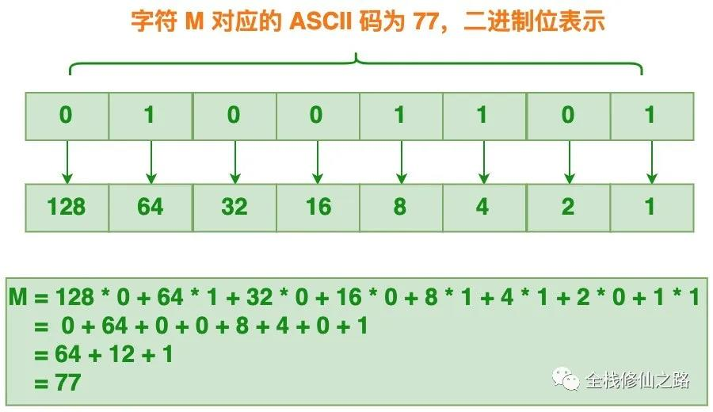

> 前端处理图片流程


> 图片相关数据转换


### 本地图片预览
> FileReader API

在支持FileReader API的浏览器中，可以利用该API方便地实现图片本地预览。
```html
<!DOCTYPE html>
<html>
  <head>
    <meta charset="UTF-8" />
    <meta name="viewport" content="width=device-width, initial-scale=1.0" />
    <title>图片本地预览示例</title>
  </head>
  <body>
    <h3>图片本地预览示例</h3>
    <input type="file" accept="image/*" onchange="loadFile(event)" />
    

    <script>
      const loadFile = function (event) {
        const reader = new FileReader();
        reader.onload = function () {
          const output = document.querySelector("#previewContainer");
          output.src = reader.result;
        };
        reader.readAsDataURL(event.target.files[0]);
      };
    </script>
  </body>
</html>
```
为`file`类型的输入框绑定`onchange`事件处理函数`loadFile`，在该函数中，创建一个FileReader对象并为该对象绑定`onload`相应的事件处理函数，然后调用FileReader对象的readAsDataURL()方法，把本地图片对应的File对象转换为Data URL。
`对于 FileReader 对象来说，除了支持把 File/Blob 对象转换为Data URL之外，它还提供了readAsArrayBuffer() 和 readAsText() 方法，用于把 File/Blob 对象转换为其他的数据格式。`

当文件读取完成后，会触发绑定的`onload`事件处理函数，在该处理函数内部会把获取Data URL数据赋给`img`元素的`src`属性，从而实现图片本地预览。

此时img元素的src属性是一串非常奇怪的字符串：
```
data:image/png;base64,iVBORw0KGgoAAAANSUhEUgAAAhAAAAIwCAYAAADXrFK
```
这串奇怪的字符串被称为Data URL，它由四个部分组成：前缀(data:)、指示数据类型的MIME类型、如果非文本则可选的`base64`标记、数据本身：
```
data:[<mediatype>][;base64],<data>
```
`mediatype`是个MIME类型的字符串，比如"image/png"表示PNG图像文件，如果被省略，则默认值为`text/plain;charset=US-ASCII`。如果数据是文本类型，可以直接将文本嵌入（根据文档类型，使用合适的实体字符或转义字符）。如果是二进制数据，可以将数据进行base64编码之后再进行嵌入。
```
MIME(Multipurpose Internet Mail Extensions)多用途互联网邮件扩展类型，
是设定某种 扩展名的文件用一种应用程序来打开的方式类型，当该扩展名文件
被访问的时候，浏览器会自动使用应用程序来打开。多用于指定一些客户端自
定义的文件名，以及一些媒体文件打开方式。

常见的MIME类型有：超文本标记语言文本 .html text/html、PNG图像 
.png image/png、普通文本 .txt text/plain等。
```
在Web项目开发过程中，为了减少HTTP请求的数量，对应一些较小的图标，通常会使用Data URL的形式内嵌到HTML或CSS文件中。`但需要注意的是：如果图片较大，图片的色彩层次比较丰富，则不适合使用这种方式，因为该图片经过base64编码后的字符串非常大，会明显增大HTML页面的大小，从而影响加载速度。`

在Data URL中，数据是很重要的一部分，它使用base64编码的字符串来表示，因此要掌握Data URL，还需要了解Base64。

> Base64

`Base64`是一种基于64个可打印字符来表示二进制数据的表示方法，由于 2^6 = 64，所以每6个比特为一个单元，对应某个可打印字符。3个字节有24个比特，对应于4个base64单元，即3个字节可由4个可打印字符来表示。相应的转换过程如下：

`Base64常用于在处理文本数据的场合，表示、传输、存储一些二进制数据，包括MIME的电子邮件及XML的一些复杂数据。`在MIME格式的电子邮件中，base64可以用来将二进制的字节序列编码成ASCII字符序列构成的文本。使用时，在传输编码方式中指定 base64。使用的字符包括大小写拉丁字母各 26 个、数字 10 个、加号 + 和斜杠 /，共 64 个字符，等号 = 用来作为后缀用途。

base64 相应的索引表如下：


以编码`Man`为例，`Man`由M、a和n这三个字符组成，它们对应的ASCII码为77，97和110。



然后再以每6个比特为一个单元，进行base64编码操作


由图可知，`Man`(3个字节)编码的结果为`TWFu`(4个字节)，很明显经过base64编码后体积增加1/3。`Man`这个字符串的长度刚好是3，我们可以用4个base64单元来表示。但如果待编码的字符串长度不是3的整数倍时，应该如何处理？
`
如果要编码的字节数不能被 3 整除，最后会多出 1 个或 2 个字节，
那么可以使用下面的方法进行处理：先使用 0 字节值在末尾补足，
使其能够被 3 整除，然后再进行 base64 的编码。
`
以编码字符A为例，其所占的字节数为1，不能被3整除