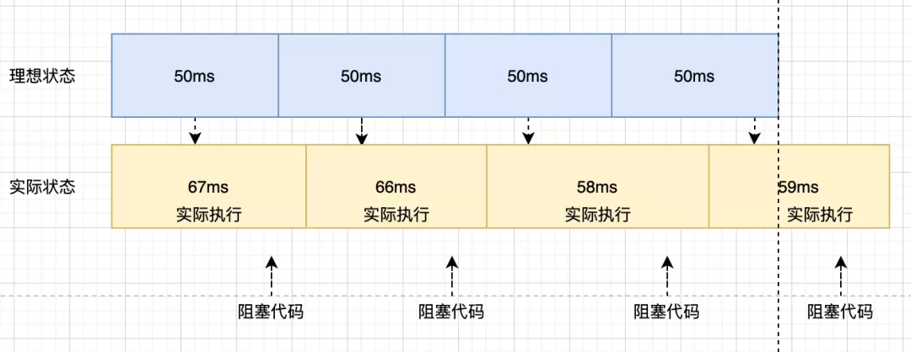

### 定时器的准确性
```html
    <form name="form">
        <div>
            <label for="ideal">理想时间：</label>
            <input type="text" name="ideal">
        </div>
        <div>
            <label for="real">实际时间：</label>
            <input type="text" name="real">
        </div>
        <div>
            <label for="diff">差异：</label>
            <input type="text" name="diff">
        </div>
    </form>
    <div>
        <button id="start" onclick="start()">正常模式</button>
        <button id="stop" onclick="stop()">停止</button>
    </div>
```
```JavaScript
    let form = document.querySelector('form'), timer;
    function start() {
        var speed = 50, // 设定间隔
            counter = 1, // 计数
            start = new Date().getTime();

        function instance() {
            var ideal = counter * speed,
                real = new Date().getTime() - start,
                diff = real - ideal;

            counter++;
            form.ideal.value = ideal.toString();
            form.real.value = real;
            form.diff.value = diff;
            clearTimeout(timer);
            timer = setTimeout(function () { instance() }, speed);
        }
        timer = setTimeout(function () { instance() }, speed);
    }

    function stop() {
        clearTimeout(timer)
    }
```
随着时间的推移，`setTimeout`实际执行的时间和理想的时间差值会越来越大，为什么`setTimeout`会不准时？


因为浏览器页面是消息队列和事件循环来驱动的，创建一个setTimeout的时候是将它推进一个队列，并没有立即执行，只有本轮宏任务执行完，才会检查当前的消息队列是否有到期的任务。
### 解决方案

#### Web Worker
```JavaScript
// worker生成器
const createWorker = (fn, options)=>{
    let blob = new Blob(['('+fn.toString()+')()']);
    let url = URL.createObjectURL(blob);
    if(options){
        return new Worker(url, options);
    }
    return new Worker(url);
}

// worker部分
const worker = createWorker(function(){
    onmessage = function(e){
        let date = Date.now();
        while(true){
            let now = Date.now();
            if(now-date>=e.data){
                postMessage(1);
                return;
            }
        }
    }
})
```
通过在worker中使用while循环
