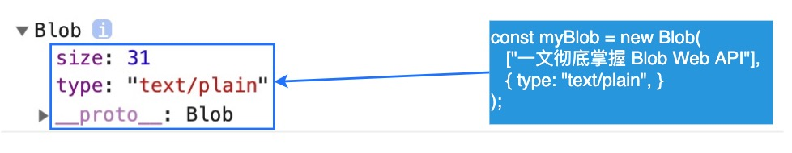
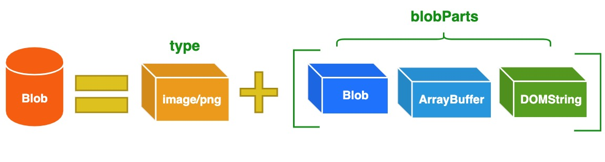

### Blob(Binary Large Object)
`Blob`表示二进制类型的大对象。在数据库管理系统中，将二进制数据存储为一个单一个体的集合。Blob 通常是影像、声音或多媒体文件。`在 JavaScript 中 Blob 类型的对象表示不可变的类似文件对象的原始数据。`


`Blob`由一个可选的字符串`type`(通常是MIME类型)和`blobParts`组成：

```
MIME(Multipurpose Internet Mail Extensions)多用途互联网邮件扩展类型，是设定某种扩展名的文件用
一种应用程序来打开的方式类型，当该扩展名文件被访问的时候，浏览器会自动使用指定应用程序来打开。
多用于指定一些客户端自定义的文件名，以及一些媒体文件打开方式。
常见的MIME类型有：超文本标记语言文本.html  text/html  PNG图像 .png  image/png  普通文本 .txt text/plain等
```
Blob表示的不一定是JavaScript原生格式的数据。比如`File`接口基于`Blob`，继承了blob的功能并将其扩展使其支持用户系统上的文件。

#### 构造函数
Blob(blobParts[,options]): 返回一个新创建的Blob对象，其内容由参数中给定的数组串联组成。
- blobParts：一个由ArrayBuffer, ArrayBufferView Blob DOMString等对象构成的数组。DOMString会被编码为UTF-8
- options: 一个可选的对象，包含以下两个属性：
    - type: 默认值为""，它将代表了将会被放入到blob中的数组内容的MIME类型
    - endings: 默认值为"transparents"，用于指定包含行结束符`\n`的字符串如何被写入。它是以下两个值中的一个："native"代表行结束符会被更改为适合宿主操作系统文件系统的换行符，或者"transparent"代表会保持blob中保存的结束符不变。

#### 属性
- Blob.size: 只读。Blob对象中所包含数据的大小（字节）

- Blob.type: 只读。一个字符串，表明该blob对象所包含数据的MIME类型。如果类型未知，则该值为空字符串。

#### 方法
- Blob.slice(): 返回一个新的Blob对象，包含了源Blob对象中指定范围内的数据
- Blob.stream()：返回一个能读取Blob内容的ReadableStream
- Blob.text()：返回一个promise且包含blob所有内容的UTF-8格式的`USVString`
- Blob.arrayBuffer()：返回一个Promise对象且包含blob所有内容的二进制的`ArrayBuffer`

**Blob对象是不可改变的**。不能直接在一个Blob中更改数据，但是可以对一个Blob进行分割，从其中创建新的Blob对象，将它们混合到一个新的Blob中。这种行为类似于JavaScript字符串：无法更改字符串中的字符，但可以创建新的更正后的字符串。

> Blob()构造函数允许通过其他对象创建Blob对象，比如用`字符串构建Blob`：

```
var debug = {};
var blob = new Blob([JSON.stringify(debug, null, 2)], { type: "application/json" });

let myBlobParts = ['<html><h2>Hello Semlinker</h2></html>']; // an array consisting of a single DOMString
let myBlob = new Blob(myBlobParts, {type : 'text/html', endings: "transparent"}); // the blob

console.log(myBlob.size + " bytes size");  // Output: 37 bytes size
console.log(myBlob.type + " is the type");  // Output: text/html is the type
```
> 从类型化数组和字符串创建Blob

```
let hello = new Uint8Array([72, 101, 108, 108, 111]); // 二进制格式的 "hello"
let blob = new Blob([hello, ' ', 'semlinker'], {type: 'text/plain'})
```

> 使用Blob创建一个指向类型化数组的URL

```
var typedArray = getTheTypedArraySomehow()
var blob = new Blob([typedArray.buffer], { type: 'application/octet-stream' }); // 传入一个合适的 MIME 类型
var url = URL.createObjectURL(blob);
// 会产生一个类似blob:d3958f5c-0777-0845-9dcf-2cb28783acaf 这样的URL字符串，像使用普通 URL 那样使用它，比如用在 img.src 上。
```
> 从Blob中提取数据

- 从Blob中读取内容的方法是使用`FileReader`
```
var reader = new FileReader();
reader.addEventListener("loadend", function(){
    // reader.result 包含被转化为类型数组typed array的blob
})
reader.readAsArrayBuffer(blob);
```
- 读取Blob中内容的方式是使用Response对象
```
var text = await (new Response(blob).text());
```

- 通过使用`FileReader`的其它方法可以把Blob读取为字符串或者数据URL

#### Blob使用场景
1. 分片上传
File对象是特殊类型的Blob，且可以用在任意的Blob类型的上下文中。所以针对大文件传输的场景，可以使用slice方法对大文件进行切割，然后分片进行长传
```
const file = new File(['a'.repeat(1000000)], 'test.txt');
const chunkSIze = 40000;

const url = "https://httpbin.org/post";
async function chunkUpload(){
    for(let start = 0; start < file.size; start += chunSize){
        const chunk = file.slice(start, start + chunkSize+1);
        const fd = new FormData();
        fd.append('data', chunk);

        await fetch(url, { method: 'post', body: fd }).then(res => res.text());
    }
}
```
2. 从互联网下载数据
```
// 原生XMLHttpRequest
const downloadBlob = (url, callback)=>{
    const xhr = new XMLHttpRequest();
    xhr.open('GET', url);
    xhr.responseType = "blob";
    xhr.onload = () =>{
        callback(xhr.response)
    }
    xhr.send(null);
}

// fetch
const myImage = document.querySelector('img');
const myRequest = new Request('flowers.jpg');

fetch(myRequest)
    .then(function(response){
        return response.blob()
    })
    .then(function(myBlob){
        let objectURL = URL.createObjectURL(myBlob);
        myImage.src = objectURL;
    })
当fetch请求成功的时候，调用response对象的`blob()`方法，从response对象中读取一个Blob对象，然后使用`createObjectURL()`方法创建一个objectURL，然后把它赋值给img元素的src属性从而显示这张图片。    
```
3. Blob用作URL

Blob URL/Object URL是一种伪协议，允许Blob和File对象用作图像，下载二进制数据链接等的URL源。在浏览器中，使用`URL.createObjectURL`方法来创建Blob URL，该方法接收一个`Blob`对象，并为其创建一个唯一的URL，其形式为`blob:<origin>/<uuid>`，对应的示例：
```
blob:https://example.org/40a5fb5a-d56d-4a33-b4e2-0acf6a8e5f641
```
浏览器内部为每个通过`URL.createObjectURL`生成的URL存储了一个URL—>Blob映射。因此，此类URL较短，但可以访问Blob。生成的URL仅在当前文档打开的状态下才有效。它允许引用``、`<a>`中的`Blob`，但如果你访问Blob URL不在存在，则会从浏览器中收到404错误。

上面的Blob URL虽然存储了URL—>Blob的映射，但Blob本身仍驻留在内存中，浏览器无法释放它。映射在文档卸载时自动清除，因此Blob对象随后释放。但是，如果应用程序寿命很长，那不会很快发生。因此，如果创建一个Blob URL，即使不再需要Blob，他也会存在内存中。

针对这个问题，可以调用`URL.revokeObjectURL(url)`方法，从内部映射中删除引用，从而允许删除Blob（如果没有其他引用），并释放内存。
```html
<!DOCTYPE html>
<html>
    <head>
        <meta charset="UTF-8">
        <title>Blob 文件下载示例</title>
    </head>
    <body>
        <button id="downloadBtn">文件下载</button>
        <script src="index.js"></script>
    </body>
</html>
```
```JavaScript
const download = (filename, blob)=>{
    const link = document.createElement('a');
    lin.href = URL.createObjectURL(blob);
    link.download = filename;
    link.click();
    lick.remove();
    URL.revokeObjectURL(link.href);
}
const downloadBtn = document.querySelector('#downloadBtn');
downloadBtn.addEventListener('click',(event)=>{
    const fileName = "blob.txt";
    const myBlob = new Blob(['一文彻底掌握Blob Web API'], { type: 'text/plain' });
    download(fileName, myBlob);
})
```
通过调用Blob的构造函数来创建类型为"text/plain"的Blob对象，然后通过动态创建`a`标签来实现文件的下载。

4. Blob转换为Base64
`URL.createObjectURL`的一个替代方法是，将`Blob`转换为base64编码的字符串。`Base64`是一种基于64个可打印字符来表示二进制数据的表示方法，它常用于在`处理文本数据的场合，表示、传输、存储一些二进制数据，包括MIME的电子邮件及XML的一些复杂数据`。

在MIME格式的电子邮件中，base64可以用来将二进制的字节序列数据编码成ASCII字符序列构成的文本。使用时，在传输编码方式中指定base64。使用的字符包含大小拉丁字母各26个、数字10个、加号`+`和斜杠`/`，共64个字符，等号`=`用来作为后缀用途。

> 如何在HTML中嵌入base64编码的图片

在编写HTML网页时，对于一些简单图片，通常会选择将图片内容直接嵌入在网页中，从而减少不必要的网络请求，但是图片数据是二进制数据，该怎么嵌入呢？绝大多数现代浏览器都支持一种名为`Data URLs`的特性，允许使用base64对图片或其他文件的二进制数据进行编码，将其作为文本字符串嵌入网页中。

Data URLs有四个部分组成：前缀（`data:`）、指示数据类型的MIME类型、如果非文本则可选的`base64`标记、数据本身：
```
data:[<mediatype>][;base64],<data>
```
`mediatype`是个MIME类型的字符串，例如"image/jpeg"表示JPEG图像文件。如果被省略，则默认值为"text/plain;charset=US-ASCII"。如果数据是文本类型，你可以直接将文本嵌入（根据文档类型，使用合适的实体字符或转义字符）。如果是二进制数据，可以将数据进行base64编码之后再进行嵌入。

```

```
`注意：如果图片过大，图片的色彩层次比较丰富，则不适合使用这种方式，因为该图片经过base64编码后的字符串非常大，会明显增加HTM页面的大小，从而影响加载速度。`除此之外，利用FileReader API，可以方便的实现图片本地预览功能。
```
<input type="file" accept="image/*" onchange="loadFile(event)">


<script>
const loadFile = function(event){
    const reader = new FileReader();
    reader.onload = function(){
        const output = document.querySelector('output');
        output.src = reader.result;
    }
    reader.readAsDataURL(event.target.files[0]);
}
</script>
```
为file类型输入框绑定`onchange`事件处理函数loadFile，在该函数中，我们创建了一个FileReader对象并为该对象绑定`onload`相应的事件处理函数，然后调用FileReader对象的`readAsDataURL()`方法，把本地图片对应的File对象转换为Data URL。

在完成本地图片预览之后，可以直接把图片对应的Data URL数据提交到服务器，服务端需要做一些相关的处理，才能正常保存上传的图片：
```
const app = require('express')();
app.post("/upload", function(req, res){
    let imgData = req.body.imgData; // 获取POST请求中的base64图片数据
    let base64Data = imgData.replace(/^data:image\/\w+;base64,/, "");
    let dateBuffer = Buffer.from(base64Data, 'base64');
    fs.writeFile("image.png", dataBuffer, function(err){
        if(err){
            res.send(err)
        }else{
            res.send('图片上传成功！');
        }
    })
})
```
对于FileReader对象来说，除了支持把Blob/File对象转换为Data URL之外，还提供了`readAsArrayBuffer()`和`readAsText()`方法，用于把Blob/File对象转换为其它的数据格式。
```
// 从blob获取arrayBuffer
let fileReader = new FileReader();

fileReader.onload = function(event){
    let arrayBuffer = fileReader.result;
}
fileReader.readAsArrayBuffer(blob);
```
5. 图片压缩
在一些场合中，在上传本地图片时，先对图片进行一定的压缩，然后在提交到服务器，从而减少传输的数据量。在前端要实现图片压缩，利用canvas对象提供的`toDataURL()`方法，该方法接收`type`和`encodeOptions`两个可选参数。其中`type`表示图片格式，默认为`image/png`。而`encoderOptions`用于表示图片的质量。如果超出取值范围，将会使用默认值`0.92`，其它参数会被忽略。
```
// compress.js
const MAX_WIDTH = 800; // 图片最大宽度

function compress(base64, quality, mimeType){
    let canvas = document.createElement("canvas");
    let img = document.createElement("img");
    img.crossOrigin = "anonymous";
    return new Promise((resolve, reject)=>{
        img.src = base64;
        img.onload = () =>{
            let targetWidth, targetHeight;
            if(img.width > MAX_WIDTH){
                targetWidth = MAX_WIDTH;
                targetHeight = (img.height * MAX_WIDTH) / img.width;
            }else{
                targetWidth = img.width;
                targetHeight = img.height;
            }
            canvas.width = targetWidth;
            canvas.height = targetHeight;
            let ctx = canvas.getContext('2d');
            ctx.clearRect(0, 0, targetWidth, targetHeight); // 清除画布
            ctx.drawImage(img, 0, 0, canvas.width, canvas.height);
            let imageData = canvas.toDataURL(mimeType, quality / 100);
            resolve(imageData);
        }
    })
}
```
对于返回的Data URL格式的图片数据，为了进一步减少传输的数据量，可以把它转换为Blob对象：
```
function dataUrlToBlob(base64, mimeType){
    let bytes = window.atob(base64.split(',')[1]);
    let ab =  new ArrayBuffer(bytes.length);
    let ia = new Uint8Array(ab);
    for(let i = 0; i<bytes.length; i++){
        ia[i] = bytes.charCodeAt(i)
    }
    return new Blob([ab], { type: mimeType });
}
```
在转换完成后，将压缩后的图片对应的Blob对象封装在FormData对象中，然后在通过AJAX提交到服务器上：
```
function uploadFile(url, blob){
    let formData = new FormData();
    let request = new XMLHttpRequest();
    formData.append('image', blob);
    request.open("POST", url, true);
    request.send(formData);
}
```
其实Canvas对象除了提供`toDataURL()`方法之外，它还提供了一个`toBlob()`方法：
```
canvas.toBlob(callback, mimeType, qualityArgument)
```
和`toDataURL()`方法相比，`toBlob()`方法是异步的，因此多了个`callback`参数，这个`callback`回调方法默认的第一个参数就是转换好的`blob`文件信息。
```
<!DOCTYPE html>
<html>
  <head>
    <meta charset="UTF-8" />
    <meta name="viewport" content="width=device-width, initial-scale=1.0" />
    <title>本地图片压缩</title>
  </head>
  <body>
    <input type="file" accept="image/*" onchange="loadFile(event)" />
    <script src="./compress.js"></script>
    <script>
      const loadFile = function (event) {
        const reader = new FileReader();
        reader.onload = async function () {
          let compressedDataURL = await compress(
            reader.result,
            90,
            "image/jpeg"
          );
          let compressedImageBlob = dataUrlToBlob(compressedDataURL);
          uploadFile("https://httpbin.org/post", compressedImageBlob);
        };
        reader.readAsDataURL(event.target.files[0]);
      };
    </script>
  </body>
</html>
```

6. 生成PDF文档
PDF(便携式文件格式，Portable Document Format)是由Adobe Systems在1993年用于文件交换所发展出的文件格式。在浏览器端，利用一些现成的开源库，比如`jsPDF`，可以方便地生成PDF文档。
```
<!DOCTYPE html>
<html>
  <head>
    <meta charset="UTF-8" />
    <meta name="viewport" content="width=device-width, initial-scale=1.0" />
    <title>客户端生成 PDF 示例</title>
  </head>
  <body>
    <h3>客户端生成 PDF 示例</h3>
    <script src="https://unpkg.com/jspdf@latest/dist/jspdf.min.js"></script>
    <script>
      (function generatePdf() {
        const doc = new jsPDF();
        doc.text("Hello semlinker!", 66, 88);
        const blob = new Blob([doc.output()], { type: "application/pdf" });
        blob.text().then((blobAsText) => {
          console.log(blobAsText);
        });
      })();
    </script>
  </body>
</html>
```
首先创建PDF文档对象，然后调用该对象上的`text()`方法在指定的坐标点上添加`Hello semlinker!`文本，然后利用生成的PDF内容来创建对应的Blob对象，需要注意的是设置的Blob类型为`application/pdf`，最后再把Blob对象中保存的内容转换为文本并输出到控制台。
```
%PDF-1.3
%ºß¬à
3 0 obj
<</Type /Page
/Parent 1 0 R
/Resources 2 0 R
/MediaBox [0 0 595.28 841.89]
/Contents 4 0 R
>>
endobj
....
```
其实`jsPDF`除了支持纯文本之外，还可以生成带图片的PDF文档，
```
let imgData = 'data:image/jpeg;base64,/9j/4AAQSkZJRgABAQEASABIAAD/...'
let doc = new jsPDF();

doc.setFontSize(40)
doc.text(35, 25, 'Paranyan loves jsPDF')
doc.addImage(imgData, 'JPEG', 15, 40, 180, 160)
```

#### Blob与ArrayBuffer的区别
ArrayBuffer对象用于表示通用的，固定长度的原始二进制数据缓冲区。不能直接操纵ArrayBuffer的内容，而是需要创建一个类型化数组对象或DataView对象，该对象以特定格式表示缓冲区，并使用该对象读取和写入缓冲区的内容。

Blob类型的对象表示不可变的类似文件对象的原始数据。Blob表示的不一定是JavaScript原生格式的数据。File接口基于Blob，继承了Blob功能并将其扩展为支持用户系统上的文件。

- 除非你需要使用 ArrayBuffer 提供的写入/编辑的能力，否则 Blob 格式可能是最好的。
- Blob 对象是不可变的，而 ArrayBuffer 是可以通过 TypedArrays 或 DataView 来操作。
- ArrayBuffer 是存在内存中的，可以直接操作。而 Blob 可以位于磁盘、高速缓存内存和其他不可用的位置。
- 虽然 Blob 可以直接作为参数传递给其他函数，比如 window.URL.createObjectURL()。但是，你可能仍需要 FileReader 之类的 File API 才能与 Blob 一起使用。
- Blob 与 ArrayBuffer 对象之间是可以相互转化的：
    - 使用 FileReader 的 readAsArrayBuffer() 方法，可以把 Blob 对象转换为 ArrayBuffer 对象；
    - 使用 Blob 构造函数，如 new Blob([new Uint8Array(data]);，可以把 ArrayBuffer 对象转换为 Blob 对象。

对于 HTTP 的场景，比如在 AJAX 场景下，Blob 和 ArrayBuffer 可以通过以下方式来使用：
```
function GET(url, callback) {
  let xhr = new XMLHttpRequest();
  xhr.open('GET', url, true);
  xhr.responseType = 'arraybuffer'; // or xhr.responseType = "blob";
  xhr.send();

  xhr.onload = function(e) {
    if (xhr.status != 200) {
      alert("Unexpected status code " + xhr.status + " for " + url);
      return false;
    }
    callback(new Uint8Array(xhr.response)); // or new Blob([xhr.response]);
  };
}
```
