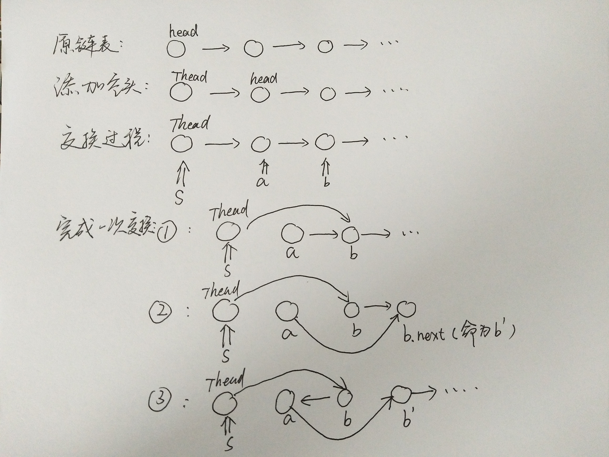

```
let swapPairs = (head) => {
    let thead = new ListNode(null),
        S = thead;
    thead.next = thead;
    while(S.next && S.next.next){
        let a = S.next, b = S.next.next;
        S.next = b;a.next = b.next.next;
        b.next = a;
        S.next = S.next.next;
    }
    return S.next;    
}
```


- 链表分区为已翻转部分+待翻转部分+未翻转部分
- 每次翻转前，要确定翻转链表的范围，这个必须通过k此循环来确定
- 需记录翻转链表前驱和后继，方便翻转完成后把已翻转部分和未翻转部分连接起来
- 初始需要两个变量pre和end，pre代表待翻转链表的前驱，end代表待翻转链表的末尾
- 经过k循环，end到达末尾，记录待翻转链表的后继next = end,next
- 翻转链表，然后将三个部分连接起来，然后重置pre和end指针，然后进入下一次循环
- 特殊情况，，当翻转部分长度不足k时，在定位end完成后，end = null,
```

```
