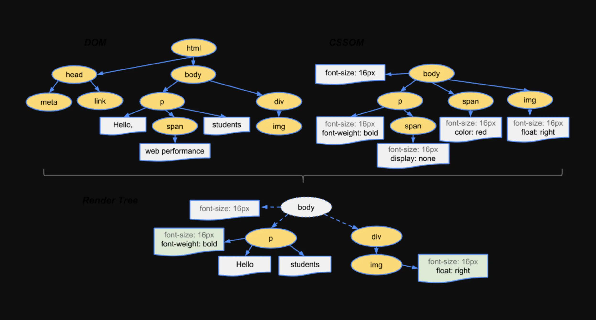

### 渲染进程
渲染页面就是让用户看见页面，核心目的在于，转换HTML、CSS、JS为用户可交互的Web页面。渲染进程中主要包含以下线程：
- Main thread主线程（负责解析，排版合成，Render Tree绘制，JavaScript执行等任务）
- Compositor thread 合成线程（或者叫排版线程，负责将网页内部位图缓存/纹理输出到窗口的帧缓存，从而把网页显示在屏幕上。在使用GPU合成的情况下，也有可能只是产生GL绘图指令，然后将绘图指令的缓存发送给GPU线程执行）
- Worker thead工作线程
- Raster thread光栅线程（如果主线程只负责将网页内容转换为绘图指令列表，光栅线程会栅格化每一个图块而且把它们存储在 GPU 的内存中，光栅化的本质是坐标变换、几何离散化，然后再填充）
- GPU thread GPU 线程（如果使用 GPU 合成，则由 GPU 线程负责执行 GL 绘图指令）

### CSS渲染原理
浏览器对压面内容的渲染首先是渲染树的构建：
- DOM树与CSSOM树合并后形成渲染树（Render Tree）
- 渲染树只包含渲染网页所需的节点

渲染树构建以后，浏览器需要做的动作为：Layout => Paint => Composite，具体含义如下：
- JavaScript JavaScript 实现动画效果，DOM 元素操作等
- Recalculate Style（或 Style） 计算将要应用到元素上的样式
- Layout 创建元素的布局并将其放置在屏幕上
- Paint 在所有创建的布局中添加像素，更多的是为每个图层创建位图，GPU 使用此位图在屏幕上渲染图层
- Composite Layers 最后，浏览器在屏幕上创建图层，构造一个图层堆栈。该堆栈的顶视图将看起来像一个完整的网页，其中每个元素都有其自己的位置

Layout 与 Paint 都是耗性能的的过程，特别是 Layout，浏览器需要重新计算样式元素的样式和位置（Recalculate Style ）。因此一般对于 CSS 的动画优化，都是尽量减少 Layout 和 Paint 操作，比如尽量避免 table 布局，尽量统一修改样式，而不是串行修改等等。
`table及其内部元素除外，他们可能需要多次计算，通常要花3倍于同等元素的时间，这也是为什么要避免使用table布局的原因之一。`

对于 left-top，因为 Layout 与 Paint 发生在动画的每一帧；而对于 transform，两个图层发送给 GPU，GPU 中 transform 是不会触发 repaint 的，因此动画执行的过程只是两个图层之间的相对移动，这也是 GPU 硬件加速的优势，能够非常快地合成完整的网页。

 CSS transform 属性实际上是创建了独立的图层，利用 GPU 硬件加速，仅仅发生了 Composite ，实现的平移动画更加平滑，性能也更好。类似的 CSS 属性还有 opacity。

 此方法的优点是，定期重绘的或通过变形在屏幕上移动的元素，可以在不影响其他元素的情况下进行处理。Sketch、GIMP 或 Photoshop 之类的文件也是如此，各个层可以在彼此的上面处理并合成，以创建最终图像页面。其他类似的属性还有 opacity、filter、will-change，创建新层的最佳方式是使用 will-change 属性。

- 尽量避免 reflow 与 repaint
- CSS 动画尽量使用 transform 与 opacity，比如 animate.css 以及 anime.js 首页提示
- 保持主线程做最正确的事，尽量避免使用 JS 动画