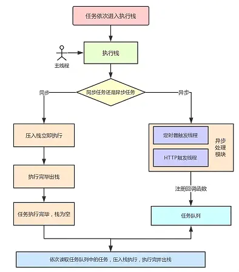

## 进程与线程
### 进程：CPU资源分配的最小单位
操作系统中执行的一个程序，操作系统以进程为单位分配存储空间，每个进程都有自己的地址空间、数据栈以及其他用于跟踪进程执行的辅助数据，操作系统管理所有进程的执行，为它们合理的分配资源。

### 线程：CPU调度和执行的最小单位
一个进程可以拥有多个并发的执行线索，简单的说就是拥有多个可以获得CPU调度的执行单元。由于线程在同一个进程下，它们可以共享相同的山下文，因此相对于进程而言，线程间的信息共享和通信更加容易。线程可以看做是轻量级的进程，同一类线程共享代码和数据空间，每个线程都有自己独立的运行站和程序计数器，线程之间切换的开销小。

### 多进程
在同一时间里，同一个计算机系统中如果允许两个或两个以上的进程处于运行状态。多进程带来的好处是明显的，比如听歌的同时，打开编辑器敲代码，编辑器和听歌软件的进程之间互相不干扰

### 多线程
程序中包含多个执行流，即在一个程序中可以同时运行多个不同的线程来执行不同的任务，也就是说允许单个程序创建多个并行执行的线程来完成各自的任务。

## 浏览器内核
浏览器内核通过取得页面内容、整理信息（应用CSS）、计算和组合最终输出可视化的图像结果，通常也被称为渲染引擎。

浏览器内核是多线程，在内核控制下各线程相互配合以保持同步，一个浏览器通常由一下常驻线程组成：
- GUI渲染线程
- JavaScript引擎线程
- 定时触发器线程
- 事件触发线程
- 异步http请求线程

> GUI渲染线程

- 主要负责页面的渲染，解析HTML、CSS，构建DOM树，布局和绘制等
- 当界面需要重绘或者由于某种操作引发回流时，将执行该线程
- 该线程与JS引擎线程互斥，当执行JS引擎线程时，GUI渲染会被挂起，当任务队列空闲时，主线程才会去执行GUI渲染

> JS引擎线程

- 主要负责处理JavaScript脚本，执行代码
- 主要负责准备好待执行的事件，即定时器计数结束，或者异步请求成功并正确返回时，将依次进入任务队列，等待JS引擎线程的执行
- 该线程与GUI渲染线程互斥，当JS引擎线程执行JavaScript脚本时间过长，将导致页面渲染的阻塞

> 定时器触发线程

- 负责执行异步定时器一类的函数线程，如：setTimeout、setInterval
- 主线程依次执行代码时，遇到定时器，会将定时器交给线程处理，当计数完毕后，事件触发线程会将计数完毕后的事件加入到任务队列的尾部，等待JS引擎线程执行。

> 事件触发线程

- 主要负责将准备好的事件交给JS引擎线程执行：setTimeout定时器计数结束，ajax等异步请求成功并触发回调函数，或者用户触发点击事件时，该线程会将整装待发的事件依次加入到任务队列的队尾，等待JS引擎线程的执行。

> 异步http请求线程

- 执行异步请求一类的函数的线程，如：Promise，axios，ajax等
- 主线程依次执行代码时，遇到异步请求时，会将函数交给该线程处理，当监听到状态码变更，如果有回调函数，事件触发线程会将回调函数加入到任务队列的尾部，等待JS引擎线程执行。 

### 浏览器中的Event Loop
> 执行栈和事件队列

当JavaScript代码执行的时候会将不同变量存于内存中的不同位置：`堆`(heap) 和`栈`(stack) 中加以区分。堆里面存放着一些对象，而栈中存放着一些基础类型变量和对象的指针。

执行栈和这个栈是不同的。当我们调用一个方法时，js会生成一个与这个方法对应的执行环境（context），又叫做执行上下文，这个执行环境中存在这个方法的私有作用域，上层作用域的指向，方法的参数，这个作用域中定义的变量以及这个作用域的this对象。而当一系列方法依次被调用的时候，因为js是单线程的，同一时间只能执行一个方法，于是这些方法被排队在一个单独的地方。这个地方被称为执行栈。

当一个脚本第一次执行的时候，js引擎会解析这段代码，并将其中的同步代码按照执行顺序加入执行栈中，然后从头开始执行。如果当前执行的是一个方法，那么js会向执行栈中添加这个方法的执行环境，然后进入这个执行环境继续执行其中的代码。当这个执行环境中的代码执行完毕并返回结果后，js会退出这个执行环境并把这个执行环境销毁，回到上一个方法的执行环境。这个过程反复进行，直到执行栈中的代码全部执行完毕。

一个方法执行会向执行栈中加入这个方法的执行环境，在这个执行环境中还可以调用其他方法，甚至是自己，其结果不过是在执行栈中再添加一个执行环境，在这个过程可以是无限进行下去的，除非发生了栈溢出，即超过了所能使用内存的最大值。

> 事件队列（Task Queue）

js引擎遇到一个异步事件后并不会一直等待其返回结果，而是将这个事件挂起，继续执行执行栈中的其他任务。当一个异步事件返回结果后，js会将这个事件加入与当前执行栈不同的另一个队列，我们称之为事件队列。被放入事件队列不会立刻执行其回调，而是等待当前执行栈中的所有任务都执行完毕，主线程处于闲置状态时，主线程会去查找事件队列是否有任务。如果有，那么主线程会从中取出排在第一位的事件，并把这个事件对应的回调放入执行栈中，然后执行其中的同步代码，如此反复，这样就形成了一个无限的循环。这个过程就被称为“事件循环（event loop）”


stack表示执行栈，web apis代表一些异步事件，callback queue即事件队列。


> micro-task与macro-task

浏览器端事件循环中的异步队列有两种：macro宏任务和micro微任务。宏任务可以有多个，微任务只能有一个。
macro-task：setTimeout、setInterval、script(整体代码)、I/O操作、UI渲染等
micro-task：new Promise().then()、MutationObserver(html5新特性)等



在一个事件循环中，异步事件返回结果后会被放到一个任务队列中，然而，根据这个异步事件的类型，这个事件实际上会被对应的宏任务队列或者微任务队列中去。并且在当前执行栈为空的时候，主线程会查看微任务队列是否有事件存在。如果不存在，那么再去宏任务队列中取出一个事件并把对应的回加入当前执行栈；如果存在，则会依次执行队列中事件对应的回调，直到微任务队列为空，然后去宏任务队列中取出最前面的一个事件，把对应的回调加入当前执行栈。。。如此反复，进入循环。

`当当前执行栈执行完毕时会立刻先处理所有微任务队列中的事件，然后再去宏任务队列中取出一个事件。同一次事件循环中，微任务永远在宏任务之前执行。`

### node环境下的事件循环机制
> 与浏览器环境不同

在node中，事件循环表现出的状态与浏览器中大致相同。不同的是node中有一套自己的模型。node中事件循环的实现是依靠的libuv引擎。node选择chrome v8引擎作为js解释器，v8引擎将js代码分析后去调用对应的node api，而这些api最后则由libuv引擎驱动，执行对应的任务，并把不同的事件放在不同的队列中等待主线程执行。因此实际上node中的事件循环存在于libuv引擎中。

> 事件循环模型

```
        ┌───────────────────────┐
    ┌─>│                    timers                         │
    │     └──────────┬────────────┘
    │     ┌──────────┴────────────┐
    │     │               I/O callbacks                   │
    │     └──────────┬────────────┘
    │     ┌──────────┴────────────┐
    │     │                 idle, prepare                  │
    │     └──────────┬────────────┘             ┌─────────────┐
    │     ┌──────────┴────────────┐             │       incoming:        │
    │     │                     poll                            │<──connections───            │
    │     └──────────┬────────────┘             │       data, etc          │
    │     ┌──────────┴────────────┐                └─────────────┘
    │     │                     check                         │
    │     └──────────┬────────────┘
    │     ┌──────────┴────────────┐
    └──┤                close callbacks                │
           └───────────────────────┘
```


