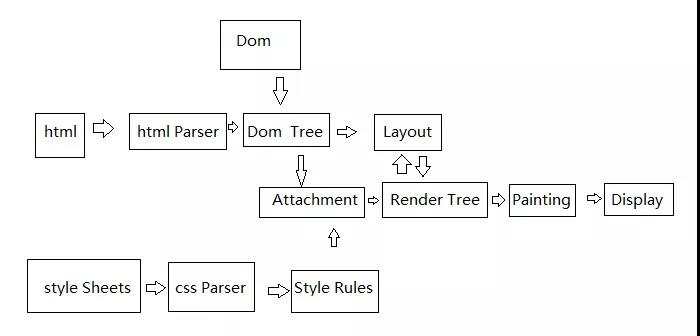
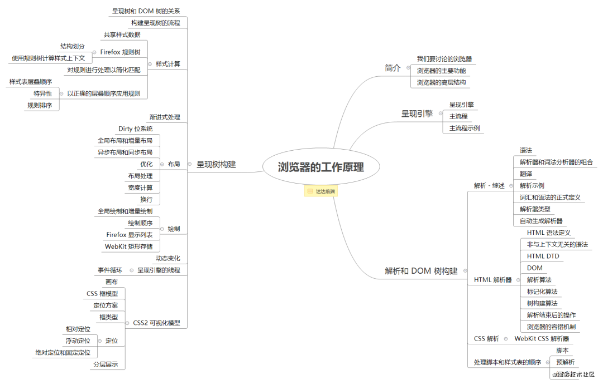

### 浏览器渲染原理

JavaScript 引擎是基于事件驱动单线程执行的，渲染线程负责渲染浏览器界面，但是 GUI 渲染线程与 JS 引擎是互斥的，当 JS 引擎执行时 GUI 线程会被挂起，GUI 的更新也会被保存在一个队列中，等到 JS 引擎空闲时才有机会执行。

> DOCTYPE 以及作用

DTD，document type definition，文档类型定义，是一系列的语法规则，用来定义 XML 或(x)HTML 的文件类型。浏览器会使用它来判断文档类型，决定使用何种协议来解析，以及切换浏览器模式。
DOCTYPE 是用来声明文档类型和 DTD 规范的，一个主要的用途便是文件的合法性验证。如果文件代码不合法，那么浏览器解析时便会出一些差错。

;

#### 重排Reflow
DOM结构中的各个元素都有自己的盒子模型，这些需要浏览器根据各种样式来计算并根据计算结果将元素放到它该出现的位置，这个过程称之为reflow。
- 当你增加，删除，修改Dom节点时会导致Reflow或Repaint
- 当你移动DOM的位置，或是搞个动画的时候
- 当你修改CSS样式的时候
- 当你Resize窗口的时候，或是滚动的时候
- 当你修改网页的默认字体时

#### 重绘Repaint
当各种盒子的位置，大小以及其他属性。列如颜色，字体大小等都确定下来后，浏览器于是便把这些元素都按照各自的特性绘制一遍，于是页面的内容出现了，这个过程称为repaint。
- DOM改动
- CSS改动

- 用户界面：包括地址栏，前进、后退按钮，书签菜单等。
- 浏览器引擎：在用户界面和呈现引擎之间传送指令。
- 呈现引擎：负责显示请求的内容。
- 网络：用于网络调用，比如HTTP请求；其接口与平台无关，并为所有平台提供底层实现。
- 用户界面后端：用于绘制基本的窗口小部件，比如组合框和窗口。其公开了与平台无关的通用接口，而在底层使用操作系统的用户界面方法。
- JavaScript解释器：用于解析和执行JavaScript代码。
- 数据存储：这是持久层。浏览器需要在硬盘上保存各种数据，例如Cookie。新的HTML规范定义了“网络数据库”，这是一个完整的浏览器内数据库